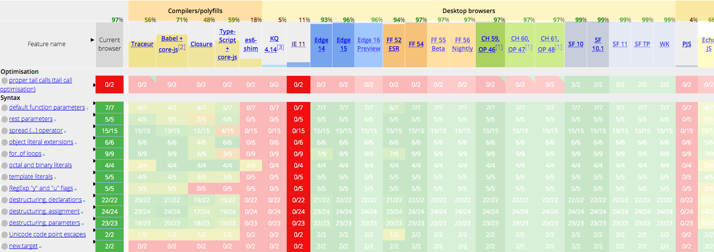

Today is July 7, 2017, and es2015 has been officially released for two years now. But the near-100% support rate of the latest browsers doesn't seem to help us much—to serve the experience of a minority of users, we very likely still need to support IE9. Thanks to Babel's compilation, we get to use const, let, and arrow functions ahead of time. Yet maybe you're still facing the dilemma of not daring to use `fetch` or `Object.assign` directly?

## Babel and Polyfills

Newcomers to Babel often assume at first that once they're using Babel, they can use es2015 painlessly—only to be ruthlessly slapped in the face by all sorts of undefined errors later. In a nutshell: Babel's compilation does not do polyfilling. So what exactly is a polyfill?

```javascript
const foo = (a, b) => {
  return Object.assign(a, b);
};
```

When we write code like the above and hand it to Babel to compile, we get:

```
"use strict";

var foo = function foo(a, b) {
    return Object.assign(a, b);
};
```

The arrow function has been compiled into an ordinary function, but on closer inspection `Object.assign` still stands firmly in place—and as a new method introduced in es2015, it can't run in quite a few browsers. Why doesn't Babel compile `Object.assign` into a fallback like `(Object.assign||function() { /*...*/})`? Good question! To preserve correct semantics, compilation can only transform syntax, not add to or modify existing properties and methods. So leaving `Object.assign` untouched is actually the most correct thing for Babel to do. The approach that handles these methods is what's known as a polyfill.

## babel-plugin-transform-xxx

The most primitive idea for solving this problem is to patch whatever is missing. Babel provides a series of transform plugins to address this. For example, for `Object.assign` we can use babel-plugin-transform-object-assign:

```shell
yarn add babel-plugin-transform-object-assign

# in .babelrc
{
  "presets": ["latest"],
  "plugins": ["transform-object-assign"]
}
```

To make it easy for you to experiment, here's some test [code](https://github.com/stonexer/babel-polyfill-test). Compiling the earlier code, we get:

```javascript
var _extends =
  Object.assign ||
  function (target) {
    for (var i = 1; i < arguments.length; i++) {
      var source = arguments[i];
      for (var key in source) {
        if (Object.prototype.hasOwnProperty.call(source, key)) {
          target[key] = source[key];
        }
      }
    }
    return target;
  };

var foo = (exports.foo = function foo(a, b) {
  return _extends(a, b);
});
```

babel-plugin-transform-object-assign substitutes the `Object.assign` method we used right before the module. It looks like it works well, but a closer look reveals the following problem:

```javascript
// another.js
export const bar = (a, b) => Object.assign(a, b);

// index.js
import { bar } from './another';

export const foo = (a, b) => Object.assign(a, b);
```

gets compiled into:

```javascript
/***/ 211:
/***/ (function(module, exports, __webpack_require__) {

"use strict";

Object.defineProperty(exports, "__esModule", {
  value: true
});
exports.foo = undefined;

var _extends = Object.assign || function (target) { for (var i = 1; i < arguments.length; i++) { var source = arguments[i]; for (var key in source) { if (Object.prototype.hasOwnProperty.call(source, key)) { target[key] = source[key]; } } } return target; };

var _another = __webpack_require__(212);

var foo = exports.foo = function foo(a, b) {
  return _extends(a, b);
};

/***/ }),

/***/ 212:
/***/ (function(module, exports, __webpack_require__) {

"use strict";

Object.defineProperty(exports, "__esModule", {
  value: true
});

var _extends = Object.assign || function (target) { for (var i = 1; i < arguments.length; i++) { var source = arguments[i]; for (var key in source) { if (Object.prototype.hasOwnProperty.call(source, key)) { target[key] = source[key]; } } } return target; };

var bar = exports.bar = function bar(a, b) {
  return _extends(a, b);
};

/***/ })
```

The transform's injection is module-level, which means that when used across multiple modules it brings duplicate injections—which can be a disaster in a multi-file project. Besides, you probably don't want to add each plugin you need one by one either. How nice it would be if they could be imported automatically.

## babel-runtime & babel-plugin-transform-runtime

The problem mentioned earlier mainly lies in the inline way methods are introduced—a line of code is inserted directly, making it impossible to optimize. With this in mind, Babel provides babel-plugin-transform-runtime, which **automatically** imports the corresponding methods from a single unified place, [core-js](https://github.com/zloirock/core-js).

Installation and usage are likewise not complicated:

```shell
yarn add -D babel-plugin-transform-runtime
yarn add babel-runtime

# .babelrc
{
  "presets": ["latest"],
  "plugins": ["transform-runtime"]
}
```

First you need to install the development dependency `babel-plugin-transform-runtime`. You also need to install the production dependency `babel-runtime`. Whether to depend on it in production too depends on how you ship your code; to keep things simple, putting it in dependencies is never wrong. Once everything is ready, it will automatically import the methods you use at compile time. But "automatic" means not necessarily precise:

```javascript
export const foo = (a, b) => Object.assign(a, b);

export const bar = (a, b) => {
  const o = Object;
  const c = [1, 2, 3].includes(3);
  return c && o.assign(a, b);
};
```

gets compiled into:

```javascript
var _assign = __webpack_require__(214);

var _assign2 = _interopRequireDefault(_assign);

function _interopRequireDefault(obj) {
  return obj && obj.__esModule ? obj : { default: obj };
}

var foo = (exports.foo = function foo(a, b) {
  return (0, _assign2.default)(a, b);
});

var bar = (exports.bar = function bar(a, b) {
  var o = Object;
  var c = [1, 2, 3].includes(3);
  return c && o.assign(a, b);
});
```

The `assign` in foo gets replaced with the required method, but the indirect call in bar is beyond its reach. At the same time, because babel-plugin-transform-runtime still doesn't take effect globally, instance methods can't be polyfilled either—for instance, a call like `[1,2,3].includes` that relies on the global `Array.prototype.includes` still can't be used.

## babel-polyfill

The shared shortcoming of the two polyfill approaches above is scope. So Babel directly provides [babel-polyfill](https://babeljs.io/docs/usage/polyfill/), which makes all es2015 methods compatible by altering the global environment. After installing `babel-polyfill`, you only need to add a single line `import 'babel-polyfill'` at the very top of all your code to bring it in; if you use webpack, you can also add babel-polyfill directly as an entry point.

```javascript
import 'babel-polyfill';

export const foo = (a, b) => Object.assign(a, b);
```

After adding babel-polyfill, the bundled polyfill.js suddenly grows to 251kb (uncompressed). (I suggest interested readers pull the code down and run it; you can also see the bundle output for all the approaches mentioned later.) Searching polyfill.js, it's not hard to find global modifications like this:

```
//polyfill
`$export($export.S + $export.F, 'Object', {assign: __webpack_require__(79)});
```

babel-polyfill inserts all the polyfill code before your project code, building a perfect es2015 runtime environment for your program. Babel recommends using babel-polyfill in web applications; as long as you don't mind its slightly large size (86kb after minification), using it directly is certainly the safest bet. Worth noting is that because the changes babel-polyfill brings are global, there's no need to import it multiple times, and importing it more than once may cause conflicts. So it's best to extract it into a common module placed in your project's vendor bundle, or simply pull it out into a standalone file hosted on a CDN.

If you're developing a library or framework, then babel-polyfill's size is a bit too much—especially when all you actually use is a single `Object.assign`. Even worse, for a library, altering the global environment is unacceptable. Nobody wants to use your library and have it drag along an entire family of polyfills that change the global objects. In this case, babel-plugin-transform-runtime, which doesn't pollute the global environment, is the most suitable choice.

## babel-preset-env

Back to application development. Optimizing by automatically detecting code to introduce polyfills doesn't seem reliable, so does that mean there's no room for optimization? Not at all. Remember babel-preset-env, the preset Babel recommends? It can determine which compilations are needed based on the specified target environment. And following a [suggestion](https://github.com/babel/babel-preset-env/issues/20) by the legendary Zhang Keyan, babel-preset-env now also supports selecting the polyfills needed for a specified target environment. You only need to import babel-polyfill and declare useBuiltIns in your babelrc, and Babel will automatically replace the imported babel-polyfill with the polyfills you actually need.

```json
# .babelrc
{
  "presets": [
    ["env", {
      "targets": {
        "browsers": ["IE >= 9"]
      },
      "useBuiltIns": true
    }]
  ]
}
```

Comparing the compiled file sizes for the "IE >= 9" and "chrome >= 59" environments:

```
               Asset     Size  Chunks
         polyfill.js   252 kB       0  [emitted]  [big]
              ie9.js   189 kB       1  [emitted]
           chrome.js  30.5 kB       2  [emitted]
transform-runtime.js  17.3 kB       3  [emitted]
transform-plugins.js  3.48 kB       4  [emitted]
```

Under the current need to support IE9, this saves nearly 30%. But surprisingly, even Chrome—the god of browsers—still needs 30kb of polyfills, probably to fix some minor spec inconsistencies in v8. (When I tried widening the browser range, I found it always stayed within 189kb, and I haven't yet looked into what's dropped compared to the full polyfill. If anyone knows, feel free to enlighten me.)

## polyfill.io

The above should already be enough for you, but in essence it still makes those quality users who are willing to use the latest browsers pay the price. Clever as you are, you may already have thought of an optimization: select polyfills based on the browser. Exactly! [polyfill.io](https://polyfill.io/v2/docs/) is a service built precisely on this idea.

You can try requesting the file `https://cdn.polyfill.io/v2/polyfill.js` in different browsers; the server inspects the browser's UA and returns a different polyfill file. All you have to do is include this file on your page, and polyfilling is automatically solved in the most elegant way. Even more delightful, polyfill.io not only provides a CDN service but has also open-sourced its own implementation, [polyfill-service](https://github.com/Financial-Times/polyfill-service). With a bit of simple configuration, you can have your own polyfill service.

It all looks wonderful, but please give it more thought before using it. Can polyfill.io accurately parse the UA given the bizarre browser environment in China? If a polyfill is missing, is there any fallback plan? These are probably things you need to consider. But regardless, it's an excellent idea and approach, and I think more websites will adopt the polyfill.io philosophy in the future. For instance, [theguardian](https://www.theguardian.com/international) and [a proposal by Redux author Dan on create-react-app](https://github.com/facebookincubator/create-react-app/issues/1104) (though it wasn't accepted, haha~).
