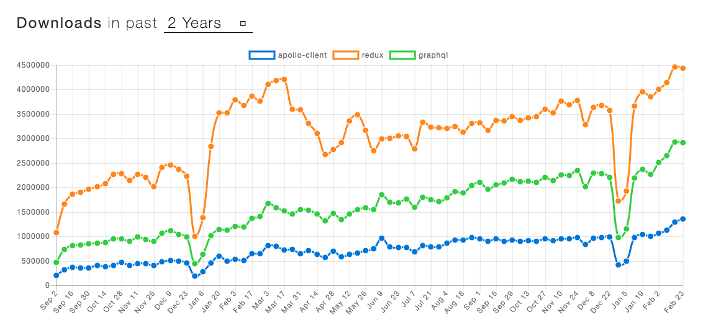
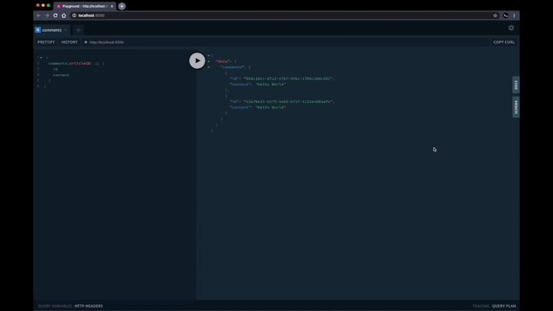
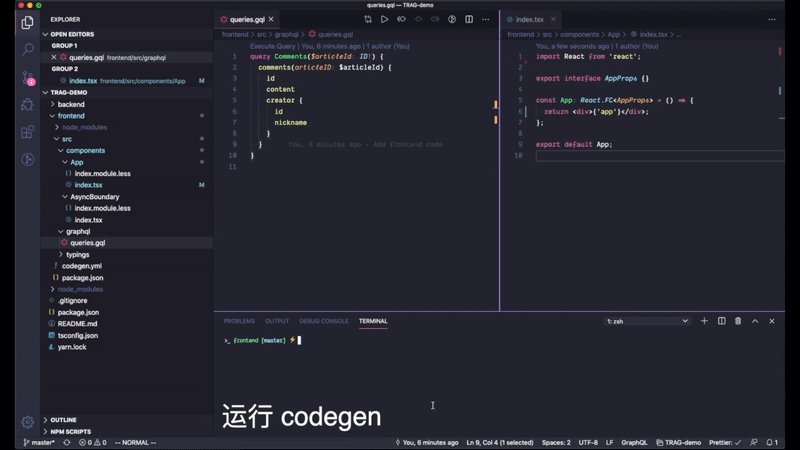

Two years ago, in [my article introducing GraphQL and Apollo](https://zhuanlan.zhihu.com/p/34238617), I predicted that "it would take off in 2018." Yet in the blink of an eye it's already 2020, and GraphQL and Apollo have not made their breakthrough.



## The Workflow

Although my prediction was off the mark, it hasn't stopped us from continuing to practice and promote GraphQL within the team over these two years. Starting last year, we once again adopted the full GraphQL + TypeScript + React + Apollo stack in a new business project. This article is, once again, my attempt as a fairly junior frontend developer to sort out the workflow I've used during this time.

To make things more intuitive, I'll once again assume a requirement we might actually run into during development. The image below is taken from the comments section under my previous article on Zhihu. Let's implement this comment-display requirement from scratch.


## 1. Agreeing on the Interface

After receiving the requirement, the first step is to define the data interface — though it's also possible you just look at whatever interface documentation the backend folks toss your way. Unlike other, looser ways of defining interfaces (various documentation tools, or just buried in DingTalk chat history), we define our GraphQL interface Types explicitly in a git repository, so we get to enjoy git's built-in history traceability and version management. Our preferred approach is for the frontend and backend to sit down together and, over coffee, hash out a GraphQL type file like this:

```ts
type CommonUserRef {
  # 用户 ID
  id: ID!
  # 昵称
  nickname: String!
  # 头像的图片链接
  avatar: String!
  #
}

type Comment {
  # 评论 ID
  id: ID!
  # 评论内容
  content: String!
  # 评论创建者
  creator: CommonUserRef!
  # 评论回复的用户
  replyTo: CommonUserRef
  # 是否为文章作者
  isAuthor: Boolean!
  # 评论创建时间
  gmtCreate: DateTime!
  # 点赞数
  likes: Int!
  # 相关回复评论
  replyComments: [Comment!]!
}

type Query {
  # >_ 假设我们无头无尾的就是需要取这些评论
  # 评论列表
  comments(articleID: ID!): [Comment!]!
}
```

While we're at it over coffee, I have to gripe again about the design of using `!` for non-nullable in GraphQL types. In real-world business, most fields have explicit constraints, and TypeScript's `?` is more convenient. A non-nullable-by-default mindset should also be more conducive to good interface design. We spent five minutes finalizing the interface, threw in a few comments along the way, and then commit and push in one smooth motion.

## 2. Codegen

Walking back to our desks and opening the familiar GraphQL Playground, we find that the backend folks have already deployed the Schema and test data we just added — that fast! We can write and test our frontend queries directly inside the GraphQL Playground.



```ts
query Comments($articleID: ID!) {
  comments(articleID: $articleID) {
    id
    content
    creator {
      id
      nickname
    }
  }
}
```

Thanks to the type system, it's not hard to write out the corresponding query-result type by cross-referencing the GraphQL query statement and the Schema types:

```ts
interface Comments {
  comments: Array<{
    id: string;
    content: string;
    creator: {
      id: string;
      nickname: string;
    };
  }>;
}
```

For exactly this reason, the community has produced a wealth of tools that automatically generate boilerplate code from a GraphQL Schema, such as [graphql-code-generator](https://graphql-code-generator.com/), [apollo-tooling:codegen](https://github.com/apollographql/apollo-tooling#apollo-clientcodegen-output), and [graphqlgen](https://github.com/prisma-labs/graphqlgen). Here, I'll use graphql-code-generator — currently the most popular — as an example to demonstrate the general idea:

In the project, you need to define the codegen-related configuration:

```yaml
# 日常环境
schema: http://daily.example.com/graphql
documents: 'src/**/*.gql'
generates:
  src/generated/graphql.tsx:
    plugins:
      - typescript
      - typescript-operations
      - typescript-react-apollo
    config:
      withHooks: true
```

Then run the graphql-codegen command. The generator reads the Schema from the backend server in the daily environment, takes all the `gql` files under `src` as input, and outputs all the related query types and React hooks into `generated/graphql.tsx`. This way, in any React component that needs to consume data, we only have to type a few letters and let code completion give us **strongly typed** query hooks and types.

It's not only when writing frontend code that we get the benefits of strong typing. GraphQL can also validate the data types of requests and responses on the server side, which means you get double type insurance at both development time and runtime — Mom no longer has to worry about that `Cannot read property of null` problem.



## 3. Hooks & Components

For the frontend request/query framework, we use [@apollo/react-hooks](https://www.apollographql.com/docs/react/data/queries/). Combined with the interface hooks generated in the previous step, we can directly write a component like this:

```tsx
const App: React.FC<AppProps> = () => {
  const { data, loading, error } = useCommentsQuery({
    variables: {
      articleId: '1',
    },
  });

  if (loading) return null;
  if (error) return <div>Error! {error}</div>;

  return (
    <div>
      {data
        ? data.comments.map((item) => <div key={item.id}>{item.content}</div>)
        : null}
    </div>
  );
};
```

It's a little verbose. To handle the `loading` and `error` states, as well as managing the nullable `data` field, we can wrap up a component like `AsyncBoundary`:

```ts
interface AsyncBoundaryProps<T = unknown> {
  loading?: boolean;
  error?: Error;
  data: T;
  // ...
}

// ...
function render() {
  if (this.props.loading) {
    return onLoading();
  }

  if (this.props.error) {
    return onError();
  }

  if (data == null) {
    return null;
  }

  return children(data as NonNullable<T>);
}
```

With that, the component can be slightly optimized into:

```tsx
const App: React.FC<AppProps> = () => {
  const commentsResult = useCommentsQuery({
    variables: {
      articleId: '1',
    },
  });

  return (
    <AsyncBoundary {...commentsResult}>
      {(data) =>
        data.comments.map((item) => <div key={item.id}>{item.content}</div>)
      }
    </AsyncBoundary>
  );
};
```

## 4. Deploying to Production

Frontend incidents often stem from your own releases or from interface changes, and a GraphQL-based workflow can offer improvements here as well. Again leveraging Codegen, before releasing code to production we can point at the production schema and run codegen once more, then recompile and bundle based on the regenerated query code — which is equivalent to re-running type checks against the production interface for every field in use. If a field changed from CommonUser! to CommonUser, it would trigger a compile error.

```json
// - codegen.daily.yaml
// - codegen,prod.yaml
//
// - package.json
{
  // ...
  "scripts": {
    "codegen:prod": "graphql-codegen --config ./codege.prod.yaml",
    "prePublish": "yarn codegen:prod && yarn build:prod"
  }
}
```

## Wrapping Up

I put together this article to help teammates who haven't used GraphQL and Apollo yet get up to speed quickly. The "backend folks" I've mentioned so many times are, in fact, the most important dependency of the entire GraphQL stack. GraphQL has been around for 8 years now, and I no longer dare call it the future of API querying. TypeScript has developed at breakneck speed over these two years, and tools like graphql-codegen have hitched a ride on that train to bring a better experience to frontend development. Along these same lines, if you're using REST but have interface documentation with a certain structure, might there be something to take away from this too? The React Conf 2019 talk [Using Hooks and Codegen | Tejas Kumar
](https://www.youtube.com/watch?v=cdsnzfJUqm0&t=1125s) might be of help to you.
