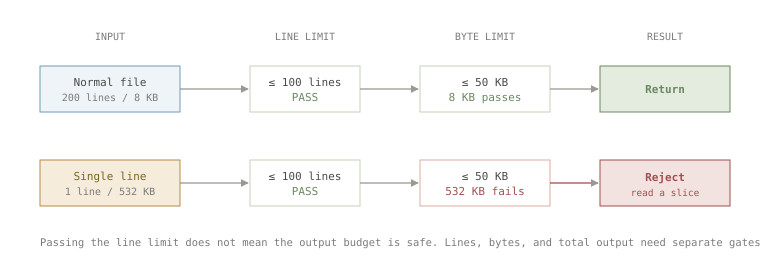
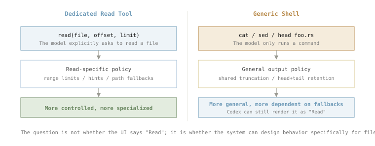
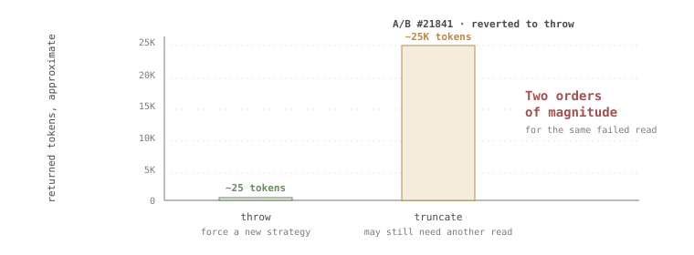

> **Note** Parts of this article are based on suspected early Claude Code source material. They are used only for technical research and design discussion. They may not reflect the current implementation of Claude Code, and some details may already be outdated.

I have been spending a lot of time with coding agents recently, and I am also building an agent-related project. There is already plenty of discussion about the big-picture architecture of an agent harness. What I want to write down here are the smaller implementation details: the parts that look boring, but directly shape how the model behaves.

The first tool that came to mind was `Read`, or `read_file`.

It may be one of the most important ways for an agent to acquire context, yet it looks almost too simple to discuss: read a file, split it into lines, support a starting point and a line limit.

```ts
interface ReadToolOptions {
  filePath: string;
  offset?: number; // line to start from
  limit?: number;  // max number of lines to read
}

async function read({ filePath, offset = 1, limit }: ReadToolOptions) {
  const content = await fs.readFile(filePath, "utf8");
  const lines = content.split("\n");
  const start = offset - 1; // offset is 1-based
  const end = limit ? start + limit : lines.length;

  return lines
    .slice(start, end)
    .map((line, i) => `${offset + i}->${line}`) // add line numbers
    .join("\n");
}
```

The line numbers before each returned line are not part of the file. They are coordinates for the model. After seeing them, the model can say "the issue is on line 42", and later it can locate or edit that region more reliably. In other words, line numbers are not really for reading. They are for everything that happens after reading.

> **Did you know?** Not every tool makes that tradeoff. Pi does not prefix every returned line with a line number. It returns the file contents more directly and adds a short position note at the end:
>
> ```
> [Showing lines 1-100 of 2048. Use offset=101 to continue.]
> ```
>
> That keeps the returned content closer to the original bytes and saves tokens. The cost is that the model does not get ready-made line anchors when it wants to refer to a location.

I thought of `offset` and `limit` immediately because files can be large, and large files should not be pushed into the model context without bounds. But that simple design quietly assumes something false: that files are made of many reasonably sized lines, so limiting the number of lines will keep the output under control.

I hit the counterexample almost immediately: a 532 KB file with only one line.

This is not rare. Minified JSON or JavaScript, source maps, SQL dumps, and even data URLs can all be single-line files. For a file like that, `limit: 10` is not useful. The first line alone is already too large to return directly.

## Memory 1: Line Limits Are Not Output Limits

The fix sounds straightforward: every return path needs limits on the dimensions that matter. A line count limit is not enough. You also need per-line limits, byte limits, and usually a final cap across all tool output.



*Figure 1. A single-line file can pass the line-count gate while still blowing past the byte budget.*

Pi's behavior is a good example. It first selects the line range requested by the model, then applies a 50 KB output limit. If the first line in the selected range exceeds that limit, it still does not return the actual content. Instead, it tells the model what smaller command it can run next:

```
// pi · packages/coding-agent/src/core/tools/read.ts
[Line 1 is 342.0KB, exceeds 50.0KB limit. Use bash: sed -n '1p' file | head -c 51200]
```

Hermes takes a different path. If a single line exceeds the default 2,000-character limit, it still returns the beginning of that line and appends a `... [truncated]` marker:

```
// hermes-agent · tools/file_operations.py
1|{"name":"foo","dependencies":{"react":"^18.2.0", ... [truncated]
```

The advantage is that the model can still infer the file type. If it sees the beginning of a JSON file, it may decide to switch to search or to a parser such as `jq`.

The shared lesson is simple: a `Read` tool should not blindly push a large, possibly meaningless chunk of content into the model. It should either reject it, summarize the problem, or provide a safer next move.

## Memory 2: Is Shell All You Need?

While looking at production logs, I noticed something that did not match my expectations: sometimes the model did not use the `read` tool at all. It tried to inspect files with `cat`, and context blowups still happened.

Then I looked at the Codex source and found another easily misunderstood detail: Codex does not have a dedicated `read` tool.

When Codex needs to read a file, the model still uses the command execution tool:

```sh
cat foo.rs
sed -n '1,200p' bar.rs
head -n 50 baz.json
```

The UI may show this as a `Read README.md` operation, but that is an interpretation layered on top of the shell command. Codex parses the command and classifies it:

```rust
pub enum ParsedCommand {
    Read { cmd, name, path },
    ListFiles { cmd, path },
    Search { cmd, query, path },
    Unknown { cmd },
}
```

Commands such as `cat`, `head`, `tail`, `awk`, `nl`, and `sed` are recognized as reads. Search commands are recognized as searches. The TUI can then render an activity log like this:

```
• Explored
  └ Read shimmer.rs
    Read status_indicator_widget.rs
    Search shimmer_spans
```

In Codex, then, `Read` is a UI interpretation of command execution. It is not a separate tool the model calls directly.



*Figure 2. A dedicated Read tool can intervene in the read process; a generic shell relies on shared command-output fallbacks.*

What happens if the model runs `cat foo.min.json` on a 500 KB single-line JSON file? If the command output exceeds the budget returned to the model, Codex falls back to its general command-output truncation logic. With byte-based truncation, `truncate_middle_chars` preserves the beginning and the end of the string and omits the middle:

```rust
// codex-rs/utils/string/src/truncate.rs
/// Truncate a string to `max_bytes` using a character-count marker.
pub fn truncate_middle_chars(s: &str, max_bytes: usize) -> String { ... }
```

The model receives something roughly like:

```
{"name":"foo","dependencies":{"react":"^18.2.0",...
...N chars truncated...
...,"version":"1.0.0","license":"MIT"}
```

This is different from keeping only the prefix. For JSON, config files, and lockfiles, the tail can contain useful information too. For normal source code, the omitted middle may be exactly where the important part was. It is not universally better. It is a general command-output strategy that happens to cover file reads.

So should an agent provide a dedicated `Read` tool? I do not have a universal answer. But a dedicated read tool gives harness authors more places to intervene: better hints, narrower recovery paths, special handling for large lines, and path-specific compatibility logic. That is a real long-term tradeoff.

## Memory 3: Sometimes Throwing Is Better Than Truncating

Intuitively, truncating and showing the model *some* content feels more helpful than throwing an error. I started with that intuition too. But there is a less obvious cost: once a tool returns a large chunk of content, that content enters the conversation context.

A Claude Code source comment records a related experiment. For explicit reads that exceeded the byte cap, the implementation was changed from throwing an error to returning truncated content. After the change shipped, the tool error rate went down, but mean token usage went up. The behavior was later reverted:

```ts
// claude-code · src/tools/FileReadTool/limits.ts
/**
 * Tested truncating instead of throwing for explicit-limit
 * reads that exceed the byte cap (#21841, Mar 2026).
 * Reverted: tool error rate dropped but mean tokens rose
 * - the throw path yields a ~100-byte error tool-result
 * while truncation yields ~25K tokens of content at the cap.
 */
```



*Figure 3. For the same oversized read, throwing and truncating can differ by orders of magnitude in context cost.*

The result makes sense. An error message may be around a hundred bytes. A near-cap truncated result may add tens of thousands of tokens. If that content is not enough to solve the problem, the model still has to issue another read. The first large return was then mostly wasted context.

So "friendlier" is not always better. Sometimes the cheaper and more effective move is to stop the model, make the failure explicit, and force a narrower read strategy.

## Memory 4: Do Not Pay Twice For The Same Context

Large files are not the only problem. A `Read` tool also has to consider repeated reads.

In logs, especially with weaker models, it is common to see the model read the same file repeatedly, sometimes even the exact same range. The simplest implementation can allow this. If the model reads the same content five times, the tool returns it five times.

But if the file has not changed, the second read rarely adds new information. It only adds more context and more tool calls.

Some tools compare the file modification time. If the file has not changed since the previous read, they do not return the full content again. They return an `unchanged` result and remind the model to use the content already present in the conversation.

Hermes is stricter. For the same path, same `offset`, and same `limit`, if the file `mtime` has not changed, the first call returns content normally, the second returns `status: "unchanged"`, and the third is blocked:

```python
# hermes-agent · tools/file_tools.py
return json.dumps({
  "error": (
    f"BLOCKED: You have called read_file on this "
    f"exact region {hits + 1} times and the file "
    "has NOT changed. STOP calling read_file for "
    "this path - the content from your earlier "
    "read_file result in this conversation is "
    "still current. Proceed with your task using "
    "the information you already have."
  ),
})
```

There is also another guard in the source that warns on the third consecutive read and blocks on the fourth. But for unchanged files where `mtime` is available, the deduplication branch above triggers earlier.

This kind of rule is somewhat blunt. Sometimes the model really does need to re-orient itself. But from a harness perspective, the goal is not to block reasonable re-reading. It is to stop repeated actions that produce no new information.

## Memory 5: Catch The Mistakes Models Commonly Make

Consider these two filenames:


*Figure 4. Two paths can look identical to a human while resolving to different filenames.*

```
Screen Shot 2026-05-24 at 3.45.32 PM.png    <- regular U+0020 space before AM/PM
Screen Shot 2026-05-24 at 3.45.32 PM.png    <- narrow no-break U+202F space before AM/PM
```

They look almost identical. On some versions of macOS, screenshot filenames use `U+202F` before `AM` or `PM`. A user may copy that path from Finder and pass it into a tool. The filesystem treats it as a different filename, even though the difference is hard to see.

Claude Code and Pi both add fallback handling for this case. If a screenshot path with a regular space does not exist, they try the narrow no-break space variant, and vice versa. Pi also tries other variants such as NFD filenames and curly quotes.

```ts
// claude-code · src/tools/FileReadTool/FileReadTool.ts
// Narrow no-break space (U+202F) used by some macOS versions
// in screenshot filenames
const THIN_SPACE = String.fromCharCode(8239)

// ...macOS uses either regular space or thin space (U+202F)
// before AM/PM depending on the macOS version. Try the alternate
// space character if the file doesn't exist with the given path.
const amPmPattern = /^(.+)([  ])(AM|PM)(\.png)$/
```

One likely reason is that models are not always reliable at producing rare whitespace characters. When the model tries to type the filename, it may output a normal space and fail to find the file.

This is only a few lines of compatibility code, but it points to a broader design principle: a harness can absorb mistakes that models commonly make when the fix is cheap and deterministic. These tiny fallback paths usually become worth adding only after real failures accumulate.

## Extension: How Should A Skill Be Read?

So far, all of this has been about safely passing file contents to the model. Skills change the question slightly.

`SKILL.md` is still a normal file, but the model usually does not read it to look up a paragraph. It reads it because it is about to follow a workflow. The purpose is closer to "invoke a capability", even though the mechanism is still file reading.

Should that go through the normal `read` path?

Hermes makes the structure explicit. `skills_list` returns names and descriptions. When the model needs a specific skill, it calls `skill_view` to retrieve the body of `SKILL.md`. The result also includes a `linked_files` index for related `references`, `templates`, `assets`, and `scripts`. To inspect one of those, the model issues another call with `file_path`.

A normal `read` tool does not know which file is the skill body and which files are supporting materials. `skill_view` exposes that structure directly.

Claude Code provides a tool called `Skill`, described as invoking a skill. The clever part is that skill authors can choose the execution mode through frontmatter. By default, the content is expanded in the current conversation. If the skill declares `context: fork`, a sub-agent with its own context executes the skill and returns the result to the main conversation.

At that point, the tool is no longer merely reading a document. It is opening an execution entrypoint.

Codex leans the other way. It does not provide a model-callable `Skill` or `skill_view` tool. At session startup, Codex scans user-level, repo-level, and built-in skills, then injects each skill's name, description, and `SKILL.md` path into the developer instructions. The model is explicitly told: once it decides to use a skill, open the skill body and linked files as needed.

That means Codex has to tell the model where every skill lives. It also spends code on compressing common path prefixes so the metadata fits into the context budget:

```
### Skill roots
- `r0` = `/Users/.../.codex`
- `r1` = `/Users/.../project/.codex`

### Available skills
- code-review: A systematic code review skill (file: r1/skills/code-review/SKILL.md)
- codex-pr-body: Compose PR body from commits (file: r1/skills/codex-pr-body/SKILL.md)
```

So instead of asking whether a skill *can* be read through normal `read`, the more useful question is: how much should the system do on the model's behalf when a skill is loaded?

A skill is still a file. But the moment the model reads it, the harness is already making workflow-design decisions.

## Read Is A Context Budget Manager

The first version of `read` was only a dozen lines. After walking through these implementations, it no longer looks like a simple tool that "returns file content".

Its real job is to manage a limited context budget. It decides which information is worth giving to the model, which outputs should be bounded, which repeated actions should be discouraged, and which common path mistakes should be handled at the system layer.

A dedicated `Read` tool and a generic shell are both defensible designs. Throwing and truncating are also both valid, depending on the situation. But a good harness turns the model's repeatable failure patterns into cheap, explicit, observable guardrails:

- cap runaway output
- avoid paying again for unchanged context
- suggest narrower reads when content is too large
- recover from common path mismatches when the fix is deterministic

This article only covered `read`. If I continue this series, `bash` may be the next good entry point: another tool that looks basic, but forces the harness to balance capability, safety, and context cost.
