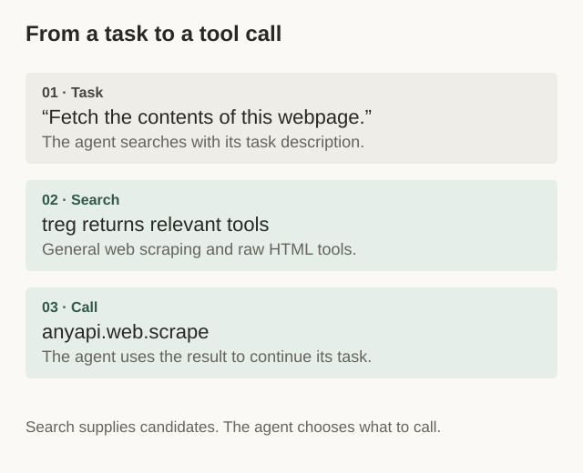
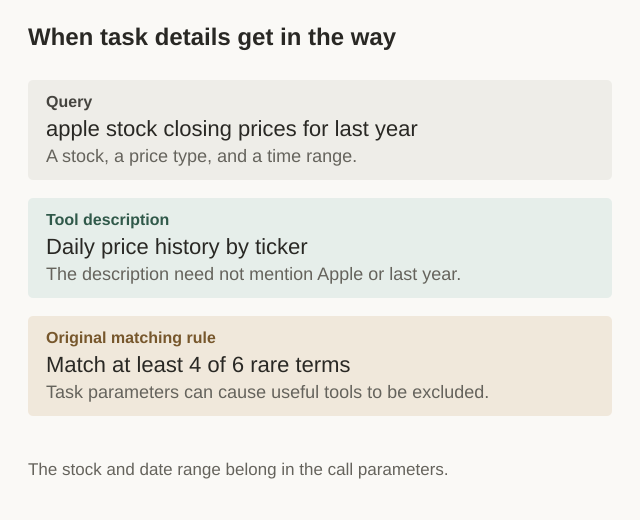
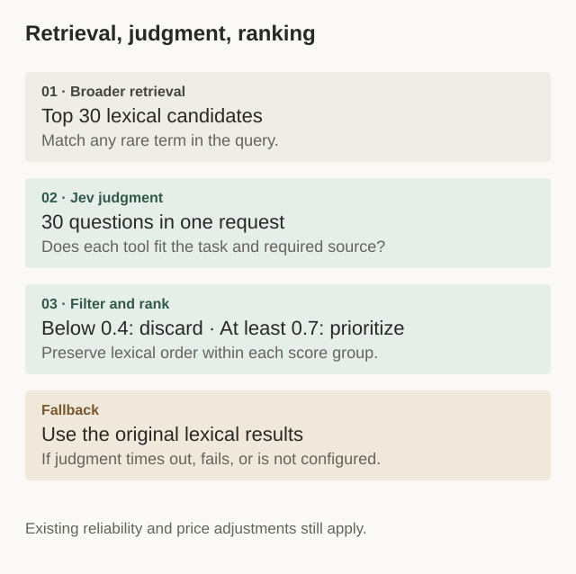
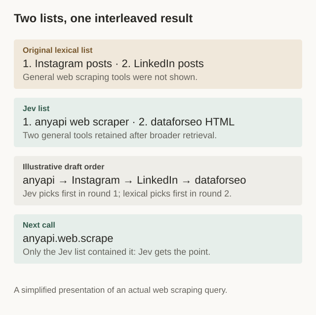
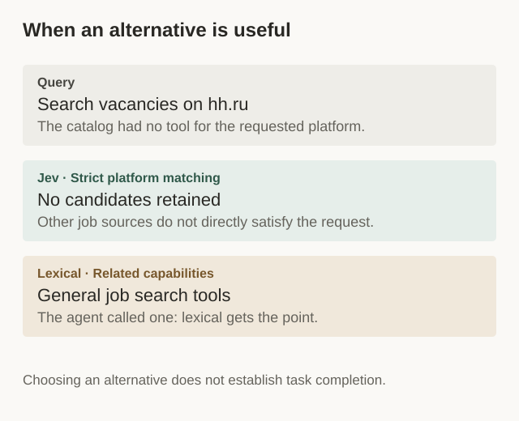

We’re building [treg](https://treg.to) to help agents find and call external APIs. Our [public catalog](https://treg.to/catalog) has more than 3,600 tools, covering everything from web and social data to company research, financial prices, and image and video generation.

That coverage creates a search problem. An agent has one task in front of it. Which of those thousands of tools should it call?

Even “find a person” can mean several things: search for people who meet certain criteria, enrich a profile, or find an email address. Several providers may offer each capability. Meanwhile, the agent’s query often includes a company name, a date range, or a specific platform. It describes the job, using words that may never appear in an API description.

We added TypeSafe’s Jev to our production search to judge whether candidate tools fit the task. Then we watched what agents actually called. In an interleaved experiment, the Jev search variant earned roughly nine points for every point earned by our original lexical search, excluding ties.

Here’s what we changed, how we measured it, and what still needs work.



*Figure 1. From a task to a tool call*

## When the tool exists but search misses it

Our original `catalog_search` used lexical matching: tokenize the query, remove stopwords, score with BM25, and require most of the rare terms to match. It ran in a few milliseconds and was easy to debug. We could inspect the matched terms and see why a result appeared or disappeared.

But our empty-result logs included queries for capabilities we already had.

Consider this one:

> apple stock closing prices for last year

Our matching rule identified six rare terms and required four matches. Yet “Apple” and “last year” are values the agent would pass to a tool. The description might simply say “daily prices by ticker.” A relevant tool could fail the matching threshold because its description didn’t name the stock or the time period.

The agent had made its request more specific, and our search had made it harder to find a tool. It shouldn’t have to strip out those details and guess our catalog’s vocabulary first.



*Figure 2. When task details get in the way*

We also saw the opposite problem: the words matched, but the tool didn’t fit.

For “trending TikTok videos today,” five of the first six results were Douyin charts. Their descriptions contained “TikTok,” “trending,” and “videos.” Lexical overlap wasn’t enough to distinguish the platforms.

## What agents were trying to do

After adding Jev, we revisited queries like these and compared the results with the agent’s next call.

**A web scraping query returned social post scrapers.**

For “scrape webpage html fetch url content,” the original results favored Instagram and LinkedIn post scrapers. Their descriptions also used words like “fetch,” “content,” and “url.”

With broader retrieval followed by Jev’s judgment, the results included anyapi’s general web scraper, scored at 0.90, and dataforseo’s raw HTML tool, scored at 0.71. Neither had appeared in the original result list. The agent then called `anyapi.web.scrape`.

**A people search returned enrichment and email tools.**

For “people search LinkedIn professional profiles,” the original results favored `people.enrich` and `people.email.find`. Those help with an already identified person or an email lookup. Jev retained tools for searching LinkedIn profiles, and the agent called the harvestapi tool, which hadn’t appeared in the original results.

| Original lexical results, excerpt | Results retained by Jev | Jev score |
| --- | --- | --- |
| `treg.people.enrich` | `moltsets.linkedin.profile.search` | 0.91 |
| `crustdata.people.enrich` | `harvestapi.linkedin.profile.search` | 0.95 |
| `treg.people.email.find` | `anyapi.linkedin.search_profiles_thin` | 0.78 |
| `leadmagic.x.b2b-profile-email` | `anyapi.linkedin.search_profiles_email` | 0.78 |

Jev retained four of the 30 candidates. Filtered candidates included `crustdata.people.enrich` and `treg.people.email.find`.

The next call was **`harvestapi.linkedin.profile.search`**. Only the Jev result list contained it, so Jev received the point.

We saw a similar distinction in “search people by company name domain employees”: lexical search returned email-finding tools, while Jev retained tools for finding employees by company.

These aren’t complicated requests. But small differences in intent change which tool is useful.

## Why we tried Jev

Retrieving candidates and then judging relevance is a familiar pattern in search and RAG. We wanted to find out whether it would help agents navigate our tool catalog with fewer retries.

Jev is TypeSafe’s System One model. It takes a state and a set of typed questions, then returns answers without generating an explanation. We use its Noul type to ask a yes-or-no question and receive a probability for “yes.”

For each candidate, the question is essentially:

> Would calling this tool directly accomplish the task, or be a necessary step toward it, on the platform or data source the task requires?

A few properties made it straightforward to try:

- **Batch judgment.** We can ask about 30 candidates in one request, sharing the same state.
- **Numeric answers.** The scores fit into our existing filtering and ranking rules.
- **Low input cost.** At the price used in this experiment, $42 per billion input tokens, a search with roughly 4,500 input tokens costs about $0.0002 in model input charges.

We later ran offline comparisons with Qwen3-Reranker and community open-source implementations, using the same queries, candidates, and tool descriptions. Both Jev and Qwen corrected some lexical ranking errors. The sample was too small to establish a general winner.

We’re keeping Jev for now while continuing to compare relevance, latency, and reliability. The production results in this article compare our Jev search variant with our original lexical search. We haven’t completed a comparison between models under equivalent production deployment conditions.

For a task such as “find the person leading this company, then find their email,” the agent still handles the steps. We’re improving how it finds a tool for each step. Query rewriting when candidate scores are low is something we’d like to explore next.

## How it fits into search

We kept lexical search and added judgment after candidate retrieval.



*Figure 3. Retrieval, judgment, ranking*

**First, broaden retrieval.** Instead of requiring most rare terms to match, we accept a match on any rare term and take the top 30 candidates by lexical score. That lets stock-price tools into the candidate set. It can also admit an App Store search tool matching “Apple,” so we need a second pass.

**Then, judge each candidate.** We send the query and candidate descriptions in one state, with a Noul question for each candidate. Here’s an abbreviated request showing two of them:

```json
{
  "model": "jev-latest",
  "state": {
    "task": "apple stock closing prices for last year",
    "candidates": [
      {
        "i": 0,
        "id": "tiingo.daily.prices",
        "name": "End-of-day stock prices by ticker - adjusted, 30+ years",
        "capability": "End-of-day price history for a ticker",
        "platform": "stocks"
      },
      {
        "i": 1,
        "id": "serpapi.app-store.search.apps",
        "name": "Search apps in the App Store by keyword",
        "platform": "app-store"
      }
    ]
  },
  "questions": {
    "c0": {
      "type": "noul",
      "instructions": "Calling the API endpoint `candidates[0]` would directly accomplish, or be a necessary step of, the task described in `task`, on the platform or data source the task implies."
    },
    "c1": {
      "type": "noul",
      "instructions": "Calling the API endpoint `candidates[1]` would directly accomplish, or be a necessary step of, the task described in `task`, on the platform or data source the task implies."
    }
  }
}
```

In this example, the stock-price tool scored 0.91 and the App Store tool scored 0.06.

**Finally, filter and group.** We discard candidates below 0.4. Candidates scoring at least 0.7 go into the priority group; those from 0.4 up to 0.7 go into the next group. Within each group, we preserve lexical order, and our existing adjustments for observed success rates and price still apply.

We don’t sort purely by Jev’s score. A small difference in model scores shouldn’t automatically override the other information we have about a tool.

## Measuring what agents chose

Reading a result list can tell us that several tools look plausible. The agent’s next call tells us which one it actually used.

Because treg handles both search and calls, we can connect those actions. That gives us a way to evaluate search before building a manually labeled dataset. A call doesn’t prove the task succeeded, but it provides feedback beyond our own inspection of the results.

We used **interleaving** for the main experiment. We generated both result lists and combined them using team draft: randomly choose which side picks first in each round, then let each side contribute its highest-ranked tool that hasn’t already been included.



*Figure 4. Simplified from a real query. The draft order is illustrative; credit uses the two original lists.*

After the agent called a tool, we applied our own scoring rule to the two original lists:

- If only one list contained the tool, that variant received the point.
- If both contained it, the variant that ranked it higher received the point.
- If the ranks were equal, we recorded a tie.

This lets us compare the variants on the same query. The combined list still has a length limit, so it doesn’t preserve every result from both sides.

We also reserved small groups of traffic for lexical-only and Jev-only results. Those let us examine calls after search and immediate repeat searches separately from the interleaved experiment.

## What we’ve seen so far

The latest interleaving tally favors Jev by about **8.6:1**, excluding ties, rounded to **9:1** in the headline. That ratio measures points under the attribution rule above, rather than a ninefold increase in search accuracy.

Our earlier online observation also showed more searches followed by calls, and fewer immediate repeat searches. The figures below are approximate.

| Jev latency in that observation | Time |
| --- | --- |
| p50 | 160 ms |
| p95 | 280 ms |

**Did a search lead to a call?** We checked whether the agent called a displayed tool within ten minutes, separating queries by whether the original lexical search had results.

| Original lexical search | Lexical-only group | Jev-only group |
| --- | --- | --- |
| Had results | 47% | 72% |
| Had no results | No displayed tool to call | 26% |

For queries where lexical search already had results, the call rate was about 25 percentage points higher in the Jev group. For queries where lexical search had no results, roughly one in four searches in the Jev group led to a call.

An empty list offers nothing to call, so that second row isn’t a like-for-like comparison of call rates. It also says nothing about whether an agent completed the task elsewhere.

**Did the agent immediately search again?** We counted another search within two minutes, with no intervening call.

| Lexical-only | Interleaved | Jev-only |
| --- | --- | --- |
| 59% | 43% | 33% |

These observations are enough for us to keep using the approach. They compare broader retrieval plus Jev judgment with the original lexical pipeline, so they don’t isolate the model’s contribution from the retrieval change.

Repeat searches need interpretation, too. When we reviewed multi-step sessions, some agents were rephrasing a failed query. Others were looking for a prerequisite, such as a place ID before fetching map reviews. Sometimes a useful tool had already been shown and the agent kept searching anyway.

We still need to see whether these differences hold over time, and whether the tools agents call return what they need.

## Where strict matching falls short

One query asked for “hh.ru vacancies search.” At the time, our catalog had no tool for that job site.

Lexical search matched “vacancies” and returned five LinkedIn and general job-search tools. Jev scored all 30 candidates below 0.4, leaving an empty list. The agent eventually called a general job-search tool from the lexical results, giving lexical search the point.



*Figure 5. When an alternative is useful*

Jev had a reasonable basis for rejecting those tools: a LinkedIn search doesn’t directly answer a request for hh.ru listings. But the agent’s choice suggests it was willing to try an alternative. We can’t tell from the call alone whether that alternative completed the task.

That leaves a product question: how should search present a useful substitute when the exact source isn’t available?

We’d like to make the distinction explicit: say that we don’t have a tool for the requested platform, then separately list possible alternatives and their limits.

Empty results also help us decide what to build. Repeated requests for capabilities such as reading and writing office data give us a concrete list to investigate. We first check whether existing tools can do the job, then decide whether to improve search or add coverage.

Rejecting all 30 candidates doesn’t establish that the catalog has no suitable tool. Retrieval may have missed it, or Jev may have filtered it incorrectly. Likewise, recovering an empty query doesn’t always mean we needed another synonym. In the stock-price example, task parameters had raised the matching threshold too far.

And some intent never makes it into the query. “Find a person” may not say whether the agent needs a profile or an email. Jev can only judge what the query and candidate descriptions tell it.

## 尾巴

This experiment showed us how agents actually look for tools, including problems we would have missed by inspecting result lists alone. We’ll keep reviewing candidates we filtered out, improving vocabulary coverage, and making it clearer when a tool is only a general alternative.

Those searches also help us decide what to add to treg. Our catalog doesn’t cover everything users want to do. We’ll keep adding tools based on those needs and sharing what we learn as we connect them and see them used.

If you have a task in mind for your agent, give it a try at [treg.to](https://treg.to). Let us know if you can’t find the right tool, or if the one you find doesn’t do the job. More tools are on the way. Stay tuned.
