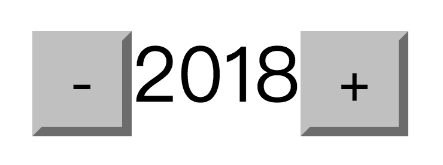

> If you're a React enthusiast who's started hearing people talk about this new language called Reason on various sites, and you've also seen [Jordan](https://github.com/jordwalke) (React's creator) say that ReasonReact is the future, but you just don't know where to begin, then this little tutorial is for you.

ps. If you're able to, you should still try to read the official docs for [Reason](https://reasonml.github.io/guide/what-and-why) and [ReasonReact](https://reasonml.github.io/reason-react/docs/en/what-why.html).

pps. Jared's [A ReasonReact Tutorial](https://jaredforsyth.com/2017/07/05/a-reason-react-tutorial/) is the best introduction to ReasonReact out there. This article also references a lot of its content, with his permission. If you can read English, just head straight over there~

## What is Reason?

Reason is a language built on top of [OCaml](http://ocaml.org/); it brings new syntax and tooling to OCaml. It can either be compiled to JavaScript via BuckleScript, or compiled directly to native binary assembly. Reason offers syntax similar to JavaScript, and you can use npm to install dependencies as well. As the saying goes, the waves behind drive on those before — Reason sheds its historical baggage, gaining over JavaScript a reliable **static type system**, while being faster and more concise!

## Why learn Reason?

> "Why should I spend time learning a brand new language? Is there something wrong with JavaScript, or are you all just being too demanding?"

Wrong! Reason isn't a brand new language. In fact, 80% of its semantics map directly onto modern JavaScript, and roughly vice versa. You only need to discard a tiny bit of JavaScript's edge-case syntax and learn a little bit of good stuff, and you'll get features that maybe won't land in JavaScript until ES2030. For most people, learning Reason won't be any slower than learning JavaScript plus some separate type system (like Flow).

If you don't believe it, first go check out the [JS -> Reason cheatsheet](https://reasonml.github.io/guide/javascript/syntax-cheatsheet/) yourself, then go play around in the [playground](https://reasonml.github.io/try/).

## Where to start?

If you played around with it and still can't get interested, you can take a detour and check out the neighbors, [elm](http://elm-lang.org/) and [ClojureScript](https://clojurescript.org/). But if you think it's ok and just don't know where to begin, then you might as well do what I did and start from React, which we're all familiar with. [Jordan](https://github.com/jordwalke) restarted a new project called [ReasonReact](https://reasonml.github.io/reason-react/), which lets us write React in a simpler and more elegant way.

## ReasonReact

ReasonReact offers some tooling similar to React's scaffolding, such as [reason-scripts](https://github.com/reasonml-community/reason-scripts). But to gain a deeper understanding, let's build our first ReasonReact project from scratch. Create a new project directory with any name you like, and let's get started~ Of course, you can also just clone the ready-made [simple-reason-react-demo](https://github.com/stonexer/simple-reason-react-demo) project for reference.

First, initialize `package.json`

```json
{
  "name": "simple-reason-react-demo",
  "version": "0.1.0",
  "scripts": {
    "start": "bsb -make-world -w",
    "build": "webpack -w"
  },
  "dependencies": {
    "react": "^16.2.0",
    "react-dom": "^16.2.0",
    "reason-react": "^0.3.0"
  },
  "devDependencies": {
    "bs-platform": "^2.1.0",
    "webpack": "^3.10.0"
  }
}
```

Then install the dependencies:

```shell
npm install --registry=https://registry.npm.taobao.org
```

The project installs the latest React and ReactDOM, plus the additional ReasonReact. For build tooling it uses the frontend industry standard Webpack and [bs-platform](https://github.com/bucklescript/bucklescript), developed by [Hongbo Zhang](https://www.zhihu.com/people/hongbo_zhang). You may not yet have a clear picture of what role BuckleScript plays here, but that's fine — for now you only need to think of it as the Reason -> JavaScript compiler, just like Babel compiles ES2016 down to ES5.

Next, we add a BuckleScript config file, `bsconfig.json`

```json
{
  "name": "simple-reason-react-demo",
  "reason": { "react-jsx": 2 },
  "refmt": 3,
  "bs-dependencies": ["reason-react"],
  "sources": "src"
}
```

You can probably guess that the project uses Reason's `react-jsx` syntax, depends on `reason-react`, and stores its source code in the `src` directory. With limited time, let's not dig deeper for now; for detailed configuration you can check out [the bsconfig.json structure](https://bucklescript.github.io/docs/zh-CN/build-configuration.html). Let's also create the src directory, and our project should now look like this

```shell
.
├── bsconfig.json
├── src
├── node_modules
└── package.json
```

# Hello, ReasonReact

Wasn't it easy getting here? Let's officially start writing Reason! Create a new `Main.re` file inside src, and write Hello World

```reason
ReactDOMRe.renderToElementWithId(
  <div>(ReasonReact.stringToElement("Hello ReasonReact"))</div>,
  "root"
);
```

Almost exactly like React code, isn't it? Then we run the compile command

```shell
# equivalent to the 'bsb -make-world -w' we wrote earlier
npm start
```

If everything goes well, you'll see a message that compilation succeeded; otherwise, you'll have to do the hard work of debugging based on the error messages. Note that bsb's output is very important to us — a lot of error messages and type-checking information all have to be read from it. Since we enabled the `-w` watch mode, which we'll keep using later, let's not exit it for now. bsb has compiled the code into the lib directory

```shell
lib
├── bs
└── js
    └── src
        └── Main.js
```

What we want to pay attention to right now is `lib/js/src/Main.js`. Open it and we can see the compiled JavaScript code — pretty beautiful, isn't it? This is all thanks to BuckleScript. To make the code run in the browser, we still need to bundle the modules with Webpack — all of which you should already be very familiar with.

Create `public/index.html`

```html
<!DOCTYPE html>
<meta charset="utf8" />
<title>你好</title>
<body>
  <div id="root"></div>
  <script src="./bundle.js"></script>
</body>
```

and `webpack.config.js`

```javascript
const path = require('path');

module.exports = {
  entry: './lib/js/src/Main.js',
  output: {
    path: path.join(__dirname, 'public'),
    filename: 'bundle.js',
  },
};
```

In the Webpack config, the entry point is './lib/js/src/Main.js' generated by the bsb compilation. Open another terminal and run `npm run build`, and all our preparation work is complete. We only use webpack for some very simple bundling, so you can basically ignore the output of this terminal and keep your attention on the start command from earlier. Next, just open the index.html file directly in your browser, and you'll see "Hello ReasonReact"~

## The first component



Let's start developing our first component, a stepper that can only increment and decrement. Create a new component file: `src/Stepper.re`

```reason
let component = ReasonReact.statelessComponent("Stepper");

let make = (children) => ({
  ...component,
  render: (self) =>
    <div>
      <div>(ReasonReact.stringToElement("I'm a Stepper! "))</div>
    </div>
});
```

`ReasonReact.statelessComponent` returns a default component definition, which contains all those lifecycle functions you're familiar with along with some other methods and properties. Here we define the `make` method; for now it only takes a `children` parameter and returns a component. We use the ES6-like `... object spread operator` to override the `render` method in `component`. The magical thing is that this snippet of code actually conforms perfectly to JavaScript syntax... Next, let's modify `Main.re` once more so that it renders this Stepper component

```reason
ReactDOMRe.renderToElementWithId(<Stepper />, "root");
```

Refresh the browser, and you should see the component we just wrote rendered out successfully just like that.

You might be curious why there's no `require()` or `import` written here. That's because Reason's cross-file dependencies are automatically inferred from your code. When the compiler sees `Stepper`, which isn't defined in `Main.re`, it automatically goes looking for the `Stepper.re` file and imports that module.

Anyone familiar with ReactJS should know that JSX isn't any special syntax — it just gets compiled into ordinary function calls, for example

```jsx
<div>Hello React</div>;
// to
React.createElement('div', null, 'Hello React');
```

while in ReasonReact, JSX gets translated into

```reason
<Stepper />
/* to */
Stepper.make([||]) /* [|1,2,3|] is the array syntax in Reason */
```

which means calling the Stepper module's make function with an empty array as the argument. This corresponds to the make function in the `Stepper.re` we wrote earlier, with this empty array corresponding to make's children parameter. Let's take another look at our first component

```reason
let component = ReasonReact.statelessComponent("Stepper");

let make = (children) => ({
  ...component,
  render: (self) =>
    <div>
      <div>(ReasonReact.stringToElement("I'm a Stepper! "))</div>
    </div>
});
```

Unlike the component `render` in ReactJS, the `render` method here needs a parameter: `self`. For now you can think of it as an analog to `this`. Since our `Stepper` is a stateless component, we don't need it yet. The `render` method likewise returns virtual DOM nodes, except that the nodes must conform to the node types ReasonReact requires. We can no longer just write `<div>Hello</div>` directly; instead we have to wrap it with the `stringToElement` provided by ReasonReact. Think the function name is too long? Just bear with it for now...

### Adding state

Thinking it over, our stepper still needs a piece of state: the number it displays. In Reason, we first need to define the `type` of the `state`

```reason
type state = {
  value: int
};
```

If you've written Flow or TypeScript, this won't seem strange at all — it indicates that our state contains a `value` field of type `int`. Then, we need to start replacing the original `statelessComponent` with `reducerComponent`, and the original component code also needs a slight modification

```reason
type state = {
  value: int
};

let component = ReasonReact.reducerComponent("Stepper");

let make = (children) => ({
  ...component,
  initialState: () => {
    value: 0
  },
  reducer: ((), state) => ReasonReact.NoUpdate,
  render: (self) =>
    <div>
      <div>(ReasonReact.stringToElement(string_of_int(self.state.value)))</div>
    </div>
});
```

Clever as you are, you've surely instantly understood that `initialState` is virtually identical to ReactJS's `getInitialState`. And the `render` part here is very similar too: the component's current state can be obtained via `self.state`, and again for type matching we wrap it in a layer of `string_of_int` to convert the `int`-typed `value` into a `string`. The newly added `reducer` function might be a little harder to understand. Here's where the interesting part comes in~

In ReactJS, we rely on `setState` to manually update the `state`. ReasonReact instead introduces the concept of a "`reducer`" — looks a lot like Redux, right? Maybe Jordan himself isn't a big fan of the non-functional operation that is `setState` either... Updating a component's state in ReasonReact is split into two steps: first dispatch an `action`, then handle it in the `reducer` and update the state. At this very moment, we haven't added an `action` yet, so the `reducer` is still a no-op — we directly return a `ReasonReact.NoUpdate` to indicate that we haven't triggered an update. Let's go on and add the `action`

```reason
type state = {
  value: int
};

/* here */
type action =
  | Increase
  | Decrease;

let component = ReasonReact.reducerComponent("Stepper");

let make = (children) => ({
  ...component,
  initialState: () => {
    value: 0
  },
  reducer: (action, state) => {
    /* here */
    switch action {
    | Decrease => ReasonReact.Update({value: state.value - 1})
    | Increase => ReasonReact.Update({value: state.value + 1})
    };
  },
  render: (self) =>
    <div>
      /* and here */
      <button onClick={self.reduce((evt) => Decrease)}>(ReasonReact.stringToElement("-"))</button>
      <div>(ReasonReact.stringToElement(string_of_int(self.state.value)))</div>
      <button onClick={self.reduce((evt) => Increase)}>(ReasonReact.stringToElement("+"))</button>
    </div>
});
```

First, we define the `action` type, which is a Variant. We've never seen this kind of value in the JavaScript world; it's used to represent the possible values of this variant (or shall we call it an "enum" for now?). Just like the recommended practice in Redux of declaring a bunch of `actionType`s first, in this example we define two kinds of `action`: + (`Increase`) and - (`Decrease`).

Then we can add click callback functions to the `button`s. We use the `self.reduce` function (remember `dispatch`?), which takes a function `(evt) => Increase` to do the conversion. You can think of it as turning the click event (which we ignore here because we don't need it...) into an `action`, and this `action` will be used by `self.reduce` to perform a side effect that updates the `state`. The operation that updates the `state` lives in the `reducer`.

Inside the `reducer` we use the form of **pattern matching** to define how the `state` should be updated for every possible `action`. For example, for an `action` of type `Increase`, we return `ReasonReact.Update({value: self.state.value + 1})` to trigger an update. It's worth noting that the component's `state` is immutable, and right now `state` only has a single field `value`, so we don't spread it out like `{...state, value: state.value + 1}`.

If you're familiar with Redux, you should already be very familiar with this paradigm (although it actually originates from Elm). The difference is that we have immutable data right out of the box, no longer needing to over-rely on JavaScript's `String` to do `actionType`, and the reducer is written more elegantly and simply — it really is a pleasure to look at~

## Continue?

This article comes to a temporary close here, and we're still missing a lot of things before we can build the functionality of a typical component. At present, I'm only using Reason in a few small personal projects, and the content of this article is quite shallow. My main hope is to inspire the brilliant you to give Reason — this still rather fresh language — a try; I believe it'll be a pleasant surprise.

Oh, and since you've read this far, why not go check out [chenglou](https://github.com/chenglou)'s wonderful talks about Reason from this year's two React Conf events~

- [Taming the Meta Language - React Conf 2017](https://www.youtube.com/watch?v=_0T5OSSzxms&t=15s)
- [What's in a language? - Cheng Lou](https://www.youtube.com/watch?v=24S5u_4gx7w&t=3s)
