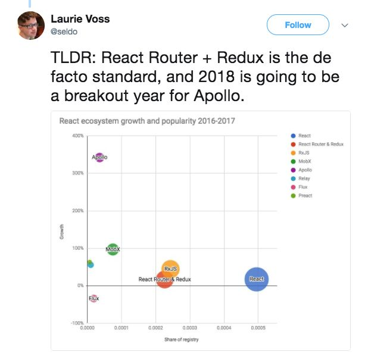
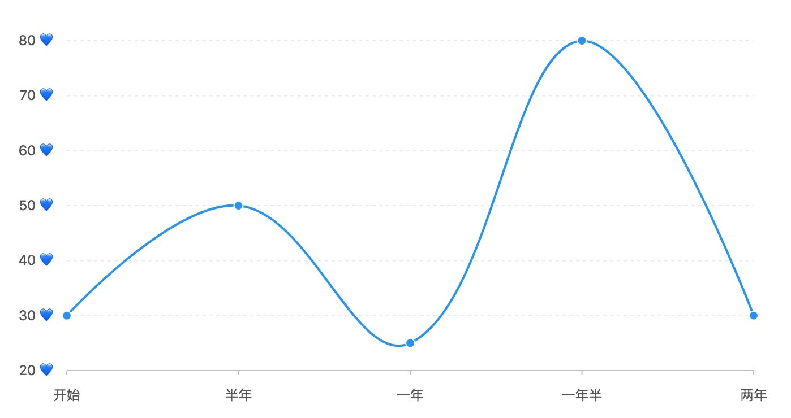
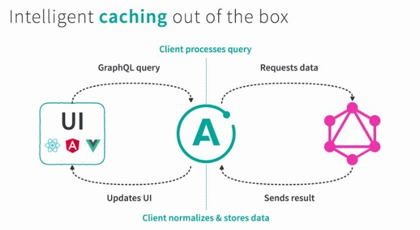
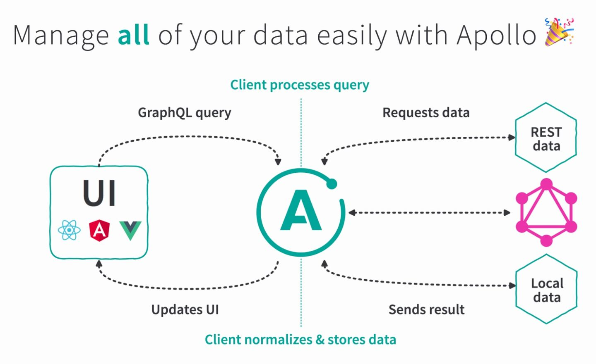

A while back, scrolling through Twitter, I noticed influencers repeatedly mentioning Apollo and predicting it would take off in 2018. As luck would have it, I had an opportunity to use GraphQL, and after skimming through Apollo's docs, I made up my mind to set aside my familiar Redux on a new frontend project and write the entire data layer with Apollo instead. A month later, I have to come out and sing the praises of this "sun god."

## GraphQL

Just like that, it's already 2018, and GraphQL is no longer a fresh term. After briefly stirring up a wave of discussion in 2015, it seems we haven't heard much about it since. Yet over these past few years GitHub has gradually matured it, and GitHub even implemented the new version of its API entirely with GraphQL. I won't go into GraphQL itself here; suffice it to say it makes fetching data between the frontend and backend much simpler.

## Redux

When it comes to frontend data management, the first thing that comes to mind is Redux. I imagine many people have gone through the various stages of getting acquainted with Redux, from stranger to old friend. It probably goes something like this:



- The beginning: Facebook designed the Flux architecture, looks impressive, everyone's using it, so I'll use it too
- Six months: data management gets a bit clearer, and I finally don't have to call `setState` chaotically back and forth inside components
- One year: I'm just a CRUD engineer writing the same cookie-cutter list and form pages over and over, and using Redux is such a hassle—how much extra code did I just write?
- A year and a half: I read up on redux-action, redux-promise, dva, mirror... and tailored the most suitable middleware and plugins to my team's business scenarios. The code got concise again!
- Two years: I've tinkered with everything there is to tinker with. A bit tired now, but I can't live without it either.

Why tired? Because Flux's unidirectional data flow no longer feels novel to you. Most of the time, what's stored in the store is data fetched from the backend, and for that data, how you dispatch and reduce isn't really the key point—rather, how to design the store is what's worth thinking about.

# When Redux Meets Business Requirements

Let's use a real-world scenario as an example:


This is a very common comment list. Once we receive the requirement, we start writing our `<Comments />` component, and under the Redux paradigm, we inevitably end up following this logic:

1. In `Comments`'s `didMount`, `dispatch` an `action` to fetch data, and inside this `fetch action` send the request. To handle the loading state, we very likely need to dispatch another action to notify Redux that we've initiated a request.
2. If the request succeeds, we dispatch an action signaling that the data fetch succeeded, then handle and update the data inside the reducer.
3. Inside `Comments` we receive the data passed in via props, and finally start rendering.

A huge chunk of our work goes into figuring out how to fetch the data. And what are the challenges we face? Let's look at a few requirements product managers might bring up:

1. When a user creates or edits a comment, the update should appear in the list immediately.

Easy—just re-request the entire list endpoint! Generally that's good enough, but a more demanding product might ask you to do "optimistic" updates to improve the experience. That's not really a problem either—just add a `reducer`.

2. When the mouse hovers over a user's avatar, pop up the user's detailed info (bio, contact info...).

First you'll think, "Can the backend guy just add all these fields into the comment endpoint's data for me?" He flatly refuses and hands you a `commonUser` endpoint for you to call yourself. On second thought, the user data isn't small, and there are plenty of repeated users across the comments, so it's actually reasonable not to put it in the list. Gritting your teeth, you decide to fully normalize the data structure on the frontend, storing the data in a hash table keyed by user id. In just one afternoon, you've arrived at a flawless solution.

Faced with scenarios like this, we write far too much _imperative_ code. We describe step by step how to fetch the comment data, then after getting the comments, extract all the user ids, deduplicate them, and request all the user data again, and so on. We also have to consider details like normalization, caching, optimistic updates, and more. And these are precisely the things Redux can't help us with. So we end up building more powerful libraries and frameworks on top of Redux, but I haven't really seen one that truly focuses on data fetching in a fitting way.

# Declarative vs Imperative

So what does it look like in the world of Apollo?

```javascript
import { graphql } from 'react-apollo';

const CommentsQuery = gql`
    query Comments() {
        comments {
            id
            content
            creator {
                id
                name
            }
        }
    }
`;

export default graphql(CommentsQuery)(Comments);
```

We used `graphql` (analogous to `connect` in Redux) as a higher-order component to bind a single GraphQL query to the Comments component, and with that, everything is ready to go. Is it really that simple? Yes—we no longer need to describe how to send the request in `didMount` or how to process the fetched data. Instead, we delegate all of this to Apollo, which dutifully sends the request to fetch the data when needed, then maps the data into the props of Comments and hands it over to us.



And it doesn't stop there—update operations also become much more convenient. For example, editing a comment. We define a GraphQL mutation:

```js
// ...

const updateComment = gql`
  mutation UpdateComment($id: Int!, $content: String!) {
    UpdateComment(id: $id, content: $content) {
      id
      content
      gmtModified
    }
  }
`;

class Comments extends React.Component {
  // ...
  onUpdateComment(id, content) {
    this.props.updateComment(id, content);
  }

  // ...
}

export default graphql(updateComment)(graphql(CommentsQuery)(Comments));
```

When we call `updateComment`, you'll magically find that the comment data in the list updates automatically. This is because apollo-client automatically caches data by type in its cache, and any data returned by a GraphQL node is automatically used to update the cache. In the `UpdateComment` mutation, we defined its return value—a newly edited comment of type Comment—and specified the fields we need to receive, `content` and `gmtModified`. This way, apollo-client automatically updates the data in the cache by id and type, thereby re-rendering our list.

Now let's look at the remaining requirement: we need to expand the user details when the mouse hovers over the user's avatar. For this requirement, we not only need to define what data we want, but we also care about "how" to fetch the data (sending the request when hovering over the avatar). Apollo likewise provides "imperative" support for us.

```js
class UserItem extends React.Component {
  // ...
  onHover() {
    const { client, id } = this.props;

    client
      .query({
        query: UserQuery,
        variables: { id },
      })
      .then((data) => {
        this.setState({ fullUserInfo: data });
      });
  }
}

export default withApollo(UserItem);
```

Fortunately, we still don't need to think about caching ourselves here. Thanks to Apollo's global data cache, once we've queried user A, querying data with the same id again will hit the cache directly—apollo-client will resolve the cached data directly without sending a request. But here's the catch: what if I want to re-query every single time?

```javascript
client.query({
  query: UserQuery,
  variables: { id },
  fetchPolicy: 'cache-and-network',
});
```

Apollo provides many policies for us to customize caching logic, such as the default `cache-first` (prefer the cache), the `cache-and-network` used here (use the cache first while sending a request to update), as well as `cache-only` and `network-only`.

These are some of the things about GraphQL and Apollo that really appeal to me. Once you start thinking from a GraphQL perspective, you care more about what data your business components need rather than how to obtain it step by step. And most of the remaining business scenarios can be solved automatically through frontend data-type inference and caching. Of course, space is limited, and there are many other elegant aspects I don't have time to mention, such as pagination, achieving optimistic updates by manipulating the cache directly, polling queries, data subscriptions, and so on. If there's a chance, we can keep exploring these in more depth.

## REST and Other Local State?

Reading this far, you might think, "GraphQL is cool, and Apollo is cool too, but my backend is REST, so I'm out of luck for now." Not necessarily. Starting from version 2.0, Apollo Client introduced Apollo Link, which in theory lets us fetch data from any type of data source through GraphQL.



"Through GraphQL" means we can write GraphQL queries to fetch data whether it comes from a REST API or from client state, so Apollo Client can manage all the data in our application on our behalf, including caching and data stitching.

```javascript
const MIXED_QUERY = gql`
    query UserInfo() {
        // graphql endpoint
        currentUser {
            id
            name
        }
        // client state
        browserInfo @client {
            platform
        }
        // rest api
        messages @rest(route: '/user/messages') @type(type: '[Message]') {
            title
        }
    }
`;
```

In a query like this, we use GraphQL directives to stitch together data from GraphQL, REST, and client state, abstracting them away and maintaining them as one. Similarly, we can also encapsulate the corresponding mutation implementations.

## Tail End

The above is roughly a bit of my shallow hands-on experience with Apollo and GraphQL over this period. Although I haven't dug very deep, I can feel the more elegant approach that Thinking in GraphQL brings to the frontend, and the efficiency of a complete frontend data-layer solution like Apollo Client. I believe that in 2018, they'll see even greater growth, and may even have the potential to replace Redux as the go-to general data management solution.

The Apollo community is fairly active too, and they often publish articles with great reference value on [dev-blog.apollodata.com](dev-blog.apollodata.com). If you're interested, feel free to take a look~
