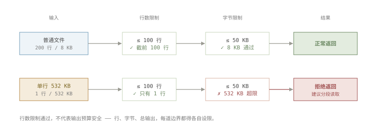
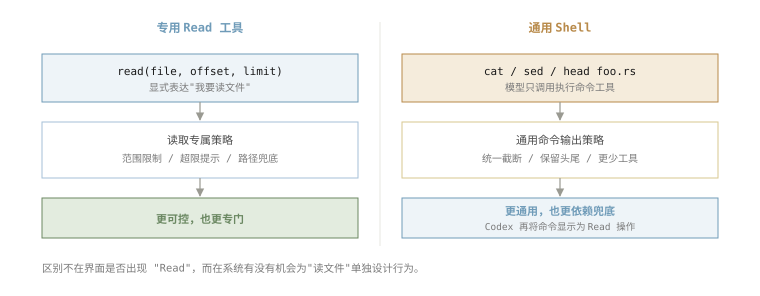

> **Note** 文中涉及的 Claude Code 早期实现仅用于技术研究与设计讨论；相关实现可能已随版本更新而变化，本文不代表当前产品行为。

## 序：一个十几行的 Read 为什么不够

最近一段时间，我一直在和各种 coding agent 打交道，也在做一个和 agent 有关的项目。关于 Harness 的大框架已经有不少讨论了，我更想记下一些容易被忽略、却会直接影响模型行为的实现细节。

第一个想到的工具就是 `Read`（或者 `read_file`）。它可能是 agent 获得上下文最重要的途径之一，看起来却简单得几乎不值得讨论：读出文件，按行切开，再支持一个起点和一个数量限制。

```ts
interface ReadToolOptions {
  filePath: string;
  offset?: number; // 从第几行开始读
  limit?: number;  // 最多读多少行
}

async function read({ filePath, offset = 1, limit }: ReadToolOptions) {
  const content = await fs.readFile(filePath, "utf8");
  const lines = content.split("\n");
  const start = offset - 1; // offset 从 1 开始
  const end = limit ? start + limit : lines.length;
  return lines
    .slice(start, end)
    .map((line, i) => `${offset + i}→${line}`)  // 带上行号
    .join("\n");
}
```

你可能注意到，`return` 之前我给每行都加上了行号。文件本身并没有行号，加它是为了给模型一个稳定的「坐标」：模型可以说「第 42 行那里有问题」，之后也方便它按行去定位、去修改。换句话说，行号不是为了「读」本身，而是为了读完之后那些要引用、要改动的动作。

> **你知道吗？** 并不是所有工具都这么做。Pi 就不给每行加行号，它把文件内容原样返回，只在末尾补一行位置信息，告诉模型现在读到哪、还能怎么往下读：
>
> ```
> [Showing lines 1-100 of 2048. Use offset=101 to continue.]
> ```
>
> 好处是返回内容更接近文件本来的字节，token 消耗也更少；代价是模型想引用「第几行」时，手上没有现成的行号锚点。

之所以一开始就想到了 `offset` 和 `limit`，是因为很容易想到文件可能很大，不能不加限制地塞进模型上下文。但光是这样其实在无意间假设了一个错误的事实：文件是由很多长度正常的行组成的，只要限制行数返回内容就不会失控。

很快我就碰到了这个假设不成立的情况：一个 532KB 的单行文件。这类文件并不少见。压缩后的 JSON / JS、source map、SQL dump，甚至 data URL，都可能只有一行。对这样的文件，`limit: 10` 也没有什么用，因为第一行本身就已经大到不适合直接返回了。

## Memory 1：行数限制不等于输出限制

解决这个问题其实也很简单。工具的返回在任何维度上都要记得做限制，比如增加单行内容的限制，又比如在所有工具返回的层面都要记得再加一道大小的限制。



比如 Pi 的处理方式就比较标准。它先取模型请求的行范围，再施加 50 KB 的输出限制。如果当前读取范围的第一行本身就超过上限，它同样不会返回实际内容，但会在结果中告诉模型下一步可以执行什么命令：

```
// pi · packages/coding-agent/src/core/tools/read.ts
[Line 1 is 342.0KB, exceeds 50.0KB limit. Use bash: sed -n '1p' file | head -c 51200]
```

而 Hermes 走的是另一条路：单行超过默认 2000 个字符时，它仍然返回这一行的前缀，并在同一行末尾加上 `... [truncated]` 标记。这样模型至少能看到这一行的开头：

```
// hermes-agent · tools/file_operations.py
1|{"name":"foo","dependencies":{"react":"^18.2.0", ... [truncated]
```

这种方案的好处是模型有机会判断文件类型。例如看到开头的一段 JSON 之后，它也许就知道应该改用搜索或 jq 之类的解析工具。

## Memory 2：Shell is all you need?

然而当我观测线上的日志时，我发现一个不符合预期的地方。模型有的时候没有使用 `read` 工具，而是直接尝试用 `cat` 去查看文件内容了，依然出现了挤爆 context 的情况。另外当我去看 Codex 源码的时候，发现它并没有一个专门的 `read` 工具。

Codex 需要读文件时，实际使用的仍然是执行命令工具，例如 `cat foo.rs`、`sed -n '1,200p' bar.rs` 或者 `head -n 50 baz.json`。界面之所以能把它显示成一次 `Read` 操作，是因为 Codex 会再解析一遍模型执行的命令。在代码里先定义了这样的类型：

```rust
pub enum ParsedCommand {
    Read { cmd, name, path },
    ListFiles { cmd, path },
    Search { cmd, query, path },
    Unknown { cmd },
}
```

`cat`、`head`、`tail`、`awk`、`nl`、`sed` 等读取命令会被识别成 `Read`，搜索命令会被识别成 `Search`。TUI 再根据这个解析结果渲染出类似这样的操作记录：

```
• Explored
  └ Read shimmer.rs
    Read status_indicator_widget.rs
    Search shimmer_spans
```



换句话说，在 Codex 这里，`Read` 是界面对命令执行的一种解释，而不是模型可以直接调用的工具。

那么它碰到一个 500KB 的单行 JSON 时会发生什么？如果模型执行的是 `cat foo.min.json`，并且输出超过了返回给模型的截断预算，内容会走通用的命令输出截断逻辑。按字节配置截断时，Codex 的 `truncate_middle_chars` 会保留字符串的头尾，并省略中间部分：

```rust
// codex-rs/utils/string/src/truncate.rs
/// Truncate a string to `max_bytes` using a character-count marker.
pub fn truncate_middle_chars(s: &str, max_bytes: usize) -> String { ... }
```

所以在按字节截断的情况下，模型拿到的内容大致会是这样：

```
{"name":"foo","dependencies":{"react":"^18.2.0",...
…N chars truncated…
...,"version":"1.0.0","license":"MIT"}
```

这和只保留开头的做法不太一样。对于 JSON、配置文件或 lockfile，尾部经常也有有用的信息，保留两端可能会更合适。对于普通源代码，中间被省略掉的内容也可能正好最重要。所以它并不是所有场景下都更好，只是命令输出的通用策略恰好也覆盖了读文件的场景。

那么究竟要不要提供专门的 `Read` 工具呢？其实我也没有答案。但从上面的例子里你应该也能看出，专门的 `Read` 工具给了 Agent 开发者更多的介入流程的机会（比如 Pi 给的提示），也能做更多精细化的控制，这里可能藏着一个长期的取舍问题。

## Memory 3：有时候报错比截断更好

直觉上，截断后至少给模型看一点内容，似乎比直接报错更有帮助。我一开始也倾向于这么做。但这里还有一个不那么直观的成本：只要工具返回了大段内容，这些内容就会进入后续上下文。

Claude Code 的源码注释里记录过一次相关实验：对于超过字节上限的显式读取，从报错改成截断内容返回。改动上线后，工具报错率下降了，但平均 token 消耗上涨，最后又改回了报错方案：

```ts
// claude-code · src/tools/FileReadTool/limits.ts
/**
 * Tested truncating instead of throwing for explicit-limit
 * reads that exceed the byte cap (#21841, Mar 2026).
 * Reverted: tool error rate dropped but mean tokens rose
 * - the throw path yields a ~100-byte error tool-result
 * while truncation yields ~25K tokens of content at the cap.
 */
```

这个结果并不难理解。一次错误消息可能只有百来个字节；一次接近上限的截断结果，则可能直接加入两万多个 token。如果这些内容不足以让模型解决问题，模型还是要再执行下一次读取，那么前一次返回的大段内容就几乎全部浪费了。


所以这里没有一个简单的「越友好越好」。有时先让模型停下来，明确换一种更窄的读取方式，反而更便宜，也更容易得到有效结果。

## Memory 4：不要反复为相同上下文付费

工具还需要考虑另一个成本：同样的内容，该不该一遍遍重复给。观察日志时很容易发现（尤其是比较「弱」的模型），模型会反复读取同一个文件，甚至是同一个范围。最简单的实现当然可以完全不干预。模型读多少次，工具就返回多少次内容。但如果文件在这期间没有变化，第二次之后的读取通常不会带来新信息，却会继续增加上下文内容和调用轮次。

有些工具会比较文件的修改时间。如果内容从上一次读取后没有变化，就不再完整返回文件，而是返回一个 unchanged 结果，提醒模型继续使用已有内容。

Hermes 的处理更强硬一些。对于同一路径、同一 `offset` 和 `limit` 组成的读取区域，如果文件的 `mtime` 没有变化，第一次正常返回内容，第二次返回 `status: "unchanged"` 的去重结果，第三次就直接拒绝：

```python
# hermes-agent · tools/file_tools.py
return json.dumps({
  "error": (
    f"BLOCKED: You have called read_file on this "
    f"exact region {hits + 1} times and the file "
    "has NOT changed. STOP calling read_file for "
    "this path - the content from your earlier "
    "read_file result in this conversation is "
    "still current. Proceed with your task using "
    "the information you already have."
  ),
})
```

源码中还存在另一条「第三次警告、第四次拒绝」的连续读取防护，但正常可以取得 `mtime` 的未变化文件，会更早被上面的去重分支拦住。这类限制多少有点武断，因为模型有时确实需要重新定位上下文。不过从 harness 的角度看，它要防的也不是一次合理的重读，而是模型在没有新信息的情况下不断重复同一个动作。

## Memory 5：把模型容易犯的错兜住

下面两个文件名，看起来几乎一样：


```
Screen Shot 2026-05-24 at 3.45.32 PM.png    ← AM/PM 前是 U+0020 普通空格
Screen Shot 2026-05-24 at 3.45.32 PM.png    ← AM/PM 前是 U+202F 窄无间断空格
```

新版 macOS 生成截图文件名时，会在 `AM` / `PM` 前使用 `U+202F`。肉眼看不出差异，但文件系统会把它当成另一个文件名。Claude Code 和 Pi 都针对这个情况做了兜底：如果含普通空格的截图路径不存在，就尝试替换为窄无间断空格；反过来也一样。

```ts
// claude-code · src/tools/FileReadTool/FileReadTool.ts
// Narrow no-break space (U+202F) used by some macOS versions
// in screenshot filenames
const THIN_SPACE = String.fromCharCode(8239)
// ...macOS uses either regular space or thin space (U+202F)
// before AM/PM depending on the macOS version. Try the alternate
// space character if the file doesn't exist with the given path.
const amPmPattern = /^(.+)([  ])(AM|PM)(\.png)$/
```

一个可能的原因是，模型生成这类罕见空白字符的可靠性比较低：当它想要写这个文件名时，很容易输出普通空格，从而找不到文件。这当然只是几行很小的兼容代码，但它提醒了我们一件事：Harness 可以主动承接模型容易犯、且修复成本很低的错误。这类细小的兼容逻辑，通常也只有在真实失败案例累积之后才会值得加入。

## 延伸：Skill 该怎么读？

前面讨论的都是「怎样把文件内容安全地交给模型」。到了 skill，问题会稍微变一下：`SKILL.md` 当然也是普通的文件，但模型读取它通常不是为了查一段文本，而是准备照着里面的流程工作。目的更接近「调用能力」，但工作方式完全就是读取一个文件。那还要不要让它继续走普通的 `read`？

Hermes 的选择很符合直觉。`skills_list` 用于返回名称和描述；需要使用某个 skill 时，再调用 `skill_view` 取得 `SKILL.md` 正文。它还会同时返回一个 `linked_files` 索引，列出可继续读取的 `references`、`templates`、`assets` 和 `scripts`；要读其中某个文件，再用 `file_path` 发起下一次调用。普通 `read` 并不知道什么是「正文」和「配套材料」，`skill_view` 则把这种结构直接暴露给了模型。

Claude Code 提供的工具就叫 `Skill`，被描述为「调用一个 Skill」。区别于普通的 `Read`，巧妙的地方在于 skill 作者可以通过 frontmatter 提前选择好这个 skill 倾向的执行方式：默认是在当前对话中展开内容；而当声明了 `context: fork` 后，Skill 就由一个拥有独立上下文的子 agent 去执行，再把结果返回给主对话。这里工具读到的已经不只是一份说明书，还是一次执行入口。

Codex 当然还是更倾向于不加工具。它没有提供一个给模型调用的 `Skill` 或 `skill_view` 工具。会话建立时，Codex 会扫描用户级、仓库级和内置的 skill，把名称、描述和 `SKILL.md` 路径作为 developer instructions 放进上下文，并明确告诉模型：决定使用某个 skill 后，再按需打开它的正文和引用文件。但代价就是，Codex 必须要完整地告诉模型每一个 skill 的具体位置，于是它也花了不少代码去尽可能压缩路径的前缀。

```
### Skill roots
- `r0` = `/Users/.../.codex`
- `r1` = `/Users/.../project/.codex`

### Available skills
- code-review: A systematic code review skill (file: r1/skills/code-review/SKILL.md)
- codex-pr-body: Compose PR body from commits (file: r1/skills/codex-pr-body/SKILL.md)
```

所以这里与其纠结「skill 能不能用普通 read 读」，不如问「读取 skill 时，系统要替模型承担多少事情」。skill 仍然是普通文件，但读它的那一刻，已经开始涉及 harness 对工作流的设计了。

## 终：Read 是上下文预算管理器

开头那版 `read` 大概只有十来行。真照着这些实现走一遍，才发现它的任务早就不是简单地「成功吐出文件内容」：它首先是在管理有限的上下文预算，判断哪些信息值得交给模型、哪些动作值得阻止。

专用 `Read` 和通用 shell 没有永远正确的选择；报错和截断也没有脱离场景的标准答案。但好的 Harness 会把模型容易反复犯的错误，变成系统层廉价、明确、可观察的防护：限制失控的输出，避免没有新信息的重读，在常见路径错误上替模型多走一步。

这篇只聊了 `read`。如果继续往下拆，`bash` 也许会是下一个合适的入口：同样看似基础，却要在能力、安全和上下文成本之间做选择。
