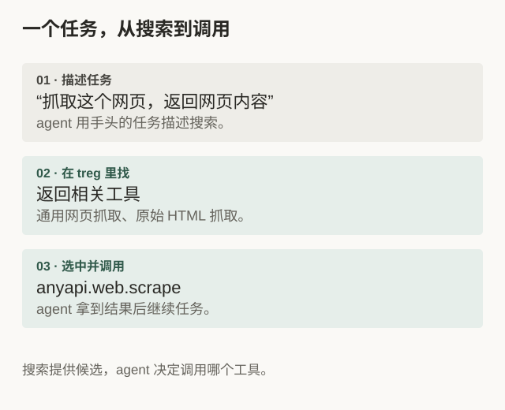
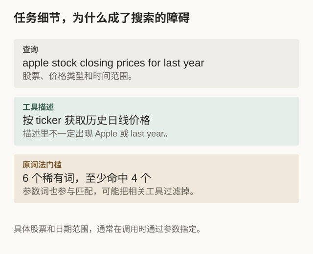
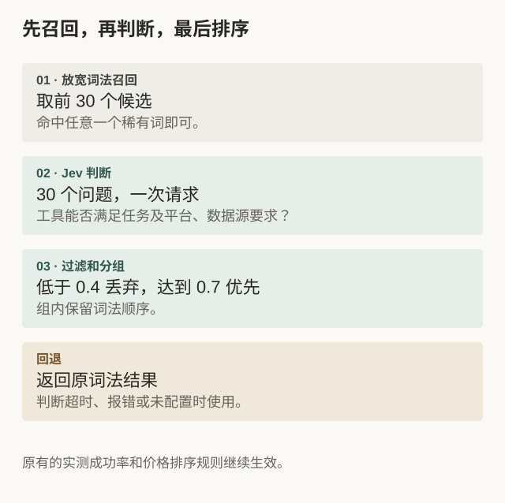
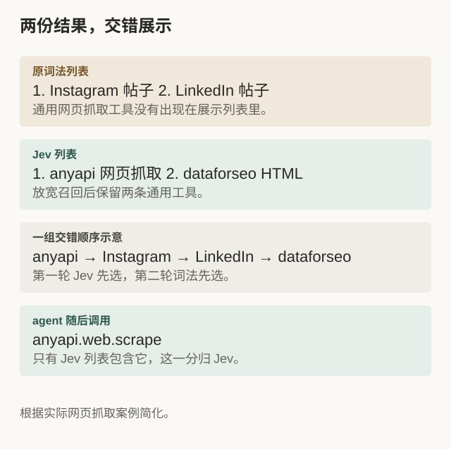
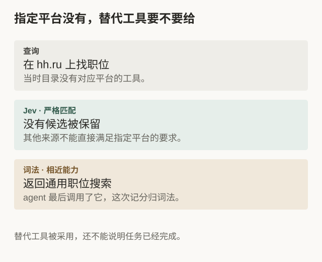

从几千个工具里，给 agent 当前的任务找到合适的那几个，是我们做 treg 时遇到的一道难题。我们把 Jev 接进了线上搜索：在交错展示的实验中，按 agent 后续调用归因的记分，Jev 与原词法搜索的对比得分约为 9:1。

我们在做的 [treg](https://treg.to)，让 agent 轻松地查找和调用外部 API。[公开 catalog 已经收录了 3,600 多个工具](https://treg.to/catalog)，从网页与社交数据、公司和联系人查询，到金融行情、图片和视频生成。我们想让 agent 手头的各种任务，都尽可能在 treg 里找到可用的工具。

覆盖越广，选择就越难。同样是“查一个人”，可能是搜索符合条件的人、补全已知用户的资料，也可能是找邮箱；同一种能力还可能有多个供应商。

这次我们把 Jev 用在这个选择过程里，并通过真实搜索之后发生的调用观察效果。



*图 1. 一个任务，从搜索到调用*

但工具接进来以后，还得让 agent 找得到。它发出的查询往往就是手头的任务，里面混着公司名、时间范围和平台要求，不会刚好照着 API 文档里的词来写。

这次我们尝试用 TypeSafe 的 Jev 检查搜索候选，判断工具能否满足查询。这篇记录想分享几个实际遇到的问题、我们的改法，以及接下来想做的事。

## 一、词法搜索漏掉了什么

treg 的 `catalog_search` 原来只做词法匹配：把查询切成词，去掉停用词，按 BM25 打分，再要求大部分稀有词命中。这套搜索只需要几毫秒，也容易排查：一个结果为什么出现、另一个为什么被过滤，看分数和命中词就能知道。

看零结果日志时，我们发现有些工具明明在目录里，却搜不出来。再检查返回的结果，还发现另一类问题：词匹配上了，工具却不适用。

先看搜不到的情况。**agent 经常把参数值也写进查询。**比如：

> apple stock closing prices for last year

这条查询有六个稀有词，规则要求至少命中四个。但 apple 指的是股票，last year 指的是时间范围，端点描述通常只会写“按 ticker 获取日线价格”。相关价格工具可能因为命中词数不足而被过滤。



*图 2. 任务细节，为什么成了搜索的障碍*

这条查询其实已经把需求说得很清楚：哪只股票、什么价格、哪段时间。但这些细节到了搜索里，却成了过滤工具的条件。让 agent 先删掉公司名和时间、猜一遍目录里的用词，才能搜到工具，这个要求不该由 agent 来承担。

另一类问题是**词相同，指的却不是同一件事**。搜 “trending TikTok videos today”，前六条里有五条是抖音（Douyin）榜单。因为它们的描述也包含 “TikTok”“trending”“videos”，光靠词法匹配区分不了这两个平台。

## 二、agent 实际在找什么

接入 Jev 后，我们回看了这些查询。下面几组对比，也能看出 agent 平时会拿 treg 做什么。

**抓网页却搜出了帖子抓取。**查询是 “scrape webpage html fetch url content”，想找的是通用网页抓取工具。词法结果靠前的却是 Instagram 和 LinkedIn 帖子抓取，因为描述里也有 fetch、content、url。Jev 留下了 anyapi 的通用网页抓取（0.90）和 dataforseo 的原始 HTML 抓取（0.71），两条都没有出现在原词法结果里。随后，agent 调用了 `anyapi.web.scrape`。

**找符合条件的人。**查询是 “people search LinkedIn professional profiles”。词法结果靠前的是 people.enrich 和 people.email.find，偏向补全已知用户的资料或查邮箱。Jev 留下了 LinkedIn 用户搜索端点，agent 随后调用了 harvestapi 那条，它没有出现在原来的词法结果里。另一条查询 “search people by company name domain employees” 也有类似情况：词法返回找邮箱的工具，Jev 留下按公司找员工的工具。

#### 词法页面 · 部分结果

1. treg.people.enrich
2. crustdata.people.enrich
3. treg.people.email.find
4. leadmagic.x.b2b-profile-email

#### Jev 页面 · 30 个候选里留 4 条

1. moltsets.linkedin.profile.search（0.91）
2. harvestapi.linkedin.profile.search（0.95）
3. anyapi.linkedin.search\_profiles\_thin（0.78）
4. anyapi.linkedin.search\_profiles\_email（0.78）

被过滤的结果包括：crustdata.people.enrich、treg.people.email.find。

**agent 随后调用** harvestapi.linkedin.profile.search Jev 独有 → 归 Jev

这些查询都不复杂，难处在于相近的词可能对应完全不同的工具。我们希望搜索结果能保留这种区别，让 agent 少花几轮去换词和试错。

## 三、用 Jev 检查候选

先召回候选，再判断相关性，是搜索和 RAG 里常见的做法。我们想验证的是，把它用到 treg 的工具目录后，能不能让 agent 少花几轮换词和试错。

这次补上的是逐条检查候选的能力：调用这个端点，能不能完成查询里的任务？

Jev 是 TypeSafe 的 System One 模型。输入是一段 state 和一组带类型的问题，返回的是对应的答案，不需要生成一段解释。我们用其中的 Noul 类型，问一个是非问题，拿到回答“是”的概率值。

对 treg 来说，这个接口比较容易接进现有搜索：

* **候选可以批量判断。**把 30 个候选对应的 Noul 问题放在同一个 state 下，一次请求就能拿到结果。
* **返回分数，方便接入排序。**我们可以按阈值过滤和分组，继续沿用已有的排序规则。
* **输入成本较低。**按本次实验采用的每十亿输入 token 42 美元计算，一次搜索约 4500 个输入 token，对应约 0.0002 美元。

我们先选 Jev，主要因为它能一次处理多个候选，直接给出数值答案，输入成本也足够低。接入以后，我们又用相同的查询、候选和工具描述，离线测试了 Qwen3-Reranker 和社区开源实现。Jev 和 Qwen 都能纠正一些词法排序中的错误，但这批小样本还不足以证明谁普遍更好。

我们暂时保留 Jev，同时继续比较效果、延迟和稳定性。这里分享的是它相对 treg 原有词法搜索的线上结果；后续模型对照还没有在同样的线上部署条件下完成。

对“先找到一家公司的负责人，再找他的邮箱”这样的多步任务，我们仍希望由使用 treg 的 agent 负责拆解。treg 这次改的是每一步找工具的过程。至于搜索本身能否在低分时用 LLM 帮忙改写查询，我们还想继续试。

## 四、在原有搜索里加一步判断

我们保留了原来的词法搜索，用它快速找出候选，再交给 Jev 筛选。整个过程分为召回、判断和排序三步。



*图 3. 先召回，再判断，最后排序*

**先放宽召回。**把“六个词命中四个”的门槛降到“命中任意一个稀有词”，按词法分数取前 30 个。这样价格端点能进候选，但也会带进只命中 apple 的 App Store 搜索，需要下一步筛选。

**再让 Jev 判断。**把查询和 30 个候选放进同一个 state，对每个候选问一个 Noul 问题：

```json
{
  "model": "jev-latest",
  "state": {
    "task": "apple stock closing prices for last year",
    "candidates": [
      {"i": 0, "id": "tiingo.daily.prices",
       "name": "End-of-day stock prices by ticker - adjusted, 30+ years",
       "capability": "End-of-day price history for a ticker", "platform": "stocks"},
      {"i": 1, "id": "serpapi.app-store.search.apps",
       "name": "Search apps in the App Store by keyword", "platform": "app-store"}
    ]
  },
  "questions": {
    "c0": {"type": "noul", "instructions": "Calling the API endpoint `candidates[0]` would directly accomplish, or be a necessary step of, the task described in `task`, on the platform or data source the task implies."},
    "c1": {"type": "noul", "instructions": "..."}
  }
}
```

返回分数：`c0 = 0.91`，`c1 = 0.06`。

在这个例子里，价格端点得到了 0.91，App Store 搜索是 0.06。

**最后按阈值分组。**低于 0.4 的候选丢弃，0.4 到 0.7 的放在一组，达到 0.7 的放在优先组。组内保留词法顺序，原有的实测成功率和价格重排也继续生效。我们没有直接按概率从高到低排序，避免细小的分数差异覆盖原有排序规则。

## 五、怎么知道 agent 更容易找到工具了

只看结果列表，很容易觉得“这几条都挺相关”。但 agent 实际选了什么，才让我们知道哪些结果被采用了。

treg 既处理搜索，也处理后续调用，我们能把这两个动作连起来看。即使没有人工标注的评测集，也可以先观察哪些结果被采用、哪些查询之后又换了词。这不能证明任务已经完成，但比只检查搜索列表多了一点反馈。

实验主要采用**交错展示**：分别算出词法和 Jev 的结果，再用 team draft 合并成一个列表。每轮随机决定哪边先选，双方依次放入自己排名最靠前、尚未出现的端点，并记录来源。



*图 4. 根据真实查询简化。交错顺序为示意，得分按两份原始列表归因。*

agent 调用端点后，我们比较它在两份原始结果中的位置。只有一边包含它，这一边得分；两边都有，排得靠前的一边得分；位置相同则记平局。两份结果完全相同时，这次调用无法帮助我们区分两种方案。

这样，同一次搜索就能比较两种排序，不必等不同用户恰好发出相近的查询。不过，混合列表仍有长度限制，不能保证保留词法列表中的每一条结果。我们也保留了少量流量，分别只展示词法或 Jev 的结果，用来观察搜索后的调用转化率和改词重搜率。

## 六、目前看到的变化

目前的结果让我们愿意继续做下去：agent 更常在搜索后调用工具，也更少马上换词重搜。最新交错记分约为 9:1；下文调用率、重搜率和延迟来自此前一轮线上观察，数字均取约数。

| 指标 | 观测结果 |
| --- | --- |
| Jev 延迟 p50 | 约 160 ms |
| Jev 延迟 p95 | 约 280 ms |
| 最新交错记分，Jev : 词法 | 约 9:1 |
| 原本无结果的查询，Jev 组后续有调用 | 约 1/4 |

**搜索后有没有调用。**在两个纯对照组中，我们统计搜索后 10 分钟内，agent 是否调用了展示结果里的端点，再按原词法搜索有没有结果分开看：

| 原词法搜索 | 只展示词法结果 | 只展示 Jev 结果 |
| --- | --- | --- |
| 有结果 | 约 47% | 约 72% |
| 无结果 | 无可调用结果 | 约 26% |

词法原本有结果时，Jev 组的调用转化率高了约 25 个百分点。词法原本无结果时，Jev 组约四分之一的搜索产生了调用。空列表没有可供调用的端点，因此这部分不能直接比较两组的调用率，也不能据此判断 agent 后来是否通过其他方式完成了任务。

**交错结果里选了谁。**排除平局后，Jev 与词法的记分实际约为 8.6:1，本文以约 9:1 作概数表述。

**有没有马上换词再搜。**我们还统计了搜索后两分钟内再次搜索、且中间没有调用的情况：

| 只展示词法结果 | 交错展示 | 只展示 Jev 结果 |
| --- | --- | --- |
| 约 59% | 约 43% | 约 33% |

展示 Jev 结果时，agent 更常接着调用，也更少马上换词重搜。调用率和重搜率来自同一轮流量，衡量的都是搜索后的行为。差异能否长期保持、调用后是否拿到了需要的结果，还要继续观察。

后来回看多轮搜索，我们也发现“又搜了一次”有不同原因：有时是在换词，有时是在找下一步需要的工具，比如查地图评论前先找地点 ID；还有些工具第一次已经展示过，agent 仍然继续搜索。因此，重搜率只能提供线索，需要连同查询变化和后续调用一起看。

## 七、有些查询，还是没解决

**目录缺少对应平台。**查询 “hh.ru vacancies search” 指定了 hh.ru 招聘网站，当时目录没有它的端点。词法搜索靠 vacancies 匹配到五条 LinkedIn 和通用职位搜索端点。Jev 给 30 个候选的分数都低于 0.4，返回空列表。agent 最后调用了词法结果中的一条通用职位搜索，这一分归词法。



*图 5. 指定平台没有，替代工具要不要给*

按查询指定的平台看，Jev 过滤这些结果有道理：LinkedIn 职位搜索无法直接完成 hh.ru 查询。但 agent 后来选择了通用职位搜索，说明它也可能接受替代方案。仅凭这次调用，还不能判断任务是否完成，也不能断言空列表就更有用。

这次词法得分，让我们多问了一句：搜索该多严格地遵守查询里的平台要求？只留完全匹配的工具，可能让 agent 无路可走；给出替代工具，又可能让它误以为找到了指定来源。我们想继续试的做法是，把“没有对应工具”说清楚，再单独列出可能有用的替代项。

**搜不到的查询也值得留着。**把这些查询放在一起看，能发现一些反复出现的需求，比如读写办公数据。我们会先检查现有工具能不能完成，再决定改搜索还是补工具。

不过，30 个候选全被拒绝，不等于整个目录都没有合适工具。还要检查相关端点是否漏在召回阶段，或被 Jev 误删。反过来，词法原本无结果、放宽召回后有工具被选中，也不一定只需加同义词：前面的股票例子，是参数词把命中门槛抬高了。我们会先区分这些原因，再决定改召回、补同义词，还是接入新工具。

**查询没有说清楚需求。**同样是“查一个人”，查询未必说明要找资料还是邮箱。Jev 只能根据查询和候选描述判断，agent 没写出来的意图仍然可能被漏掉。

## 八、尾巴

这次实验让我们看到了 agent 实际怎么找工具，也发现了不少光看搜索结果想不到的问题。接下来会继续检查误删的候选、补上常见说法，并把通用替代工具的适用范围交代清楚。

这些搜索记录也在帮我们决定 treg 接下来该加什么。用户想做的事，目录里未必都能满足。我们会根据实际需求持续补充新工具，也会继续分享接入和使用中遇到的问题。

如果你手头有想让 agent 做的事，欢迎到 [treg.to](https://treg.to) 试试。没搜到合适的工具，或者搜到了却不好用，都可以告诉我们。更多工具在路上，敬请期待。
